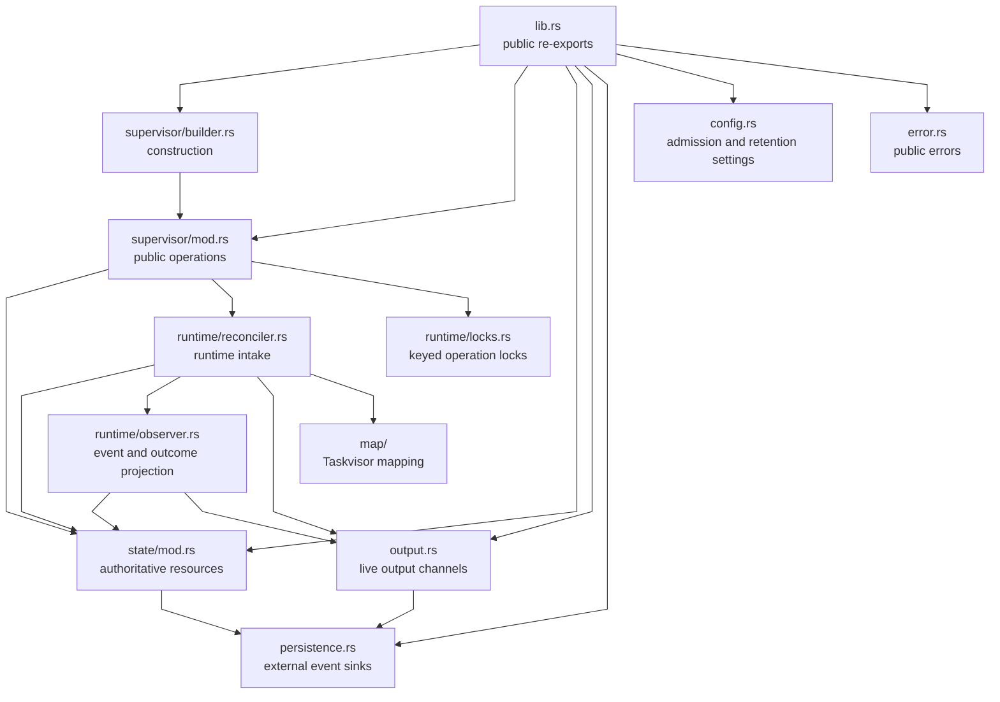
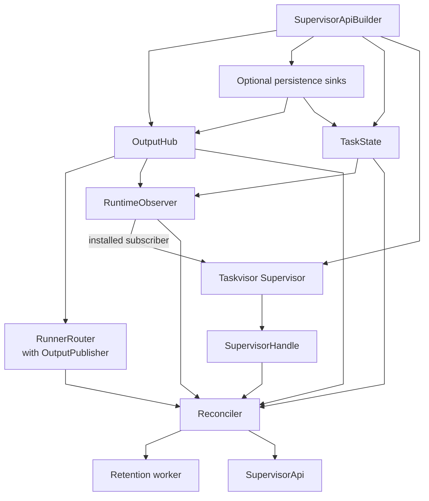
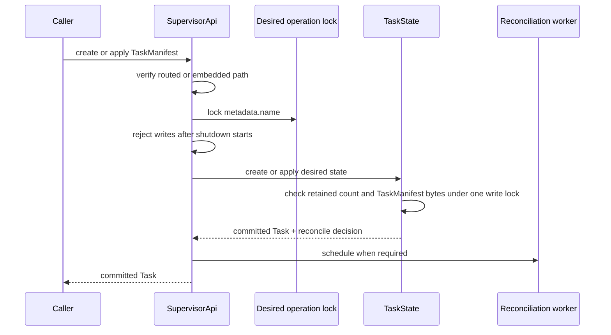
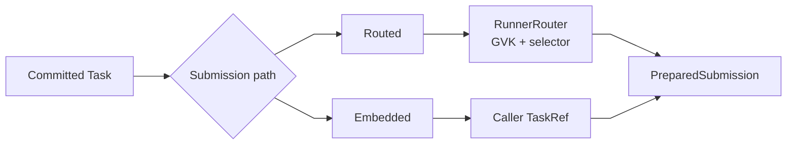
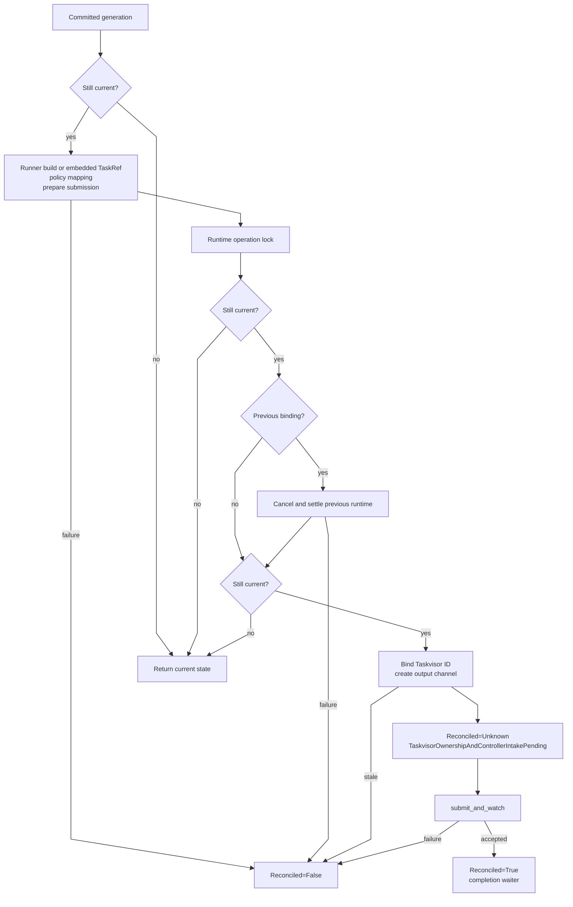
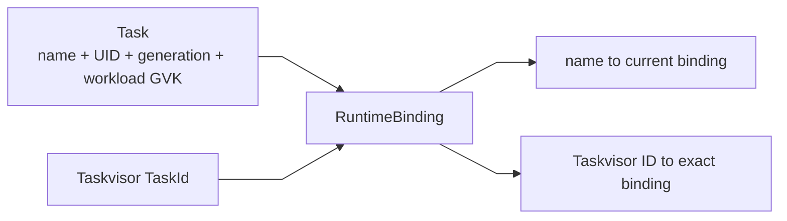
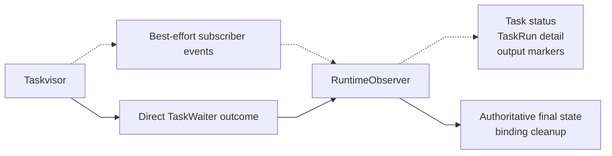

# solti-core source guide

This document is a reading map for contributors.

It shows which module owns each decision and how desired state reaches Taskvisor.
The Rust source and its module-level documentation remain the source of truth.

## Crate map

`SupervisorApi` is the public lifecycle boundary.
It coordinates state, reconciliation, output, and Taskvisor.

The arrows show direct use.
They do not represent ownership of model values.

| Module                  | Owns                                                                   | Does not own                               |
|-------------------------|------------------------------------------------------------------------|--------------------------------------------|
| `supervisor/builder.rs` | Runtime assembly and public configuration                              | Desired-state writes or task execution     |
| `supervisor/mod.rs`     | Public API operations, write scheduling, cancellation, shutdown        | Runner implementations or model validation |
| `state/mod.rs`          | Tasks, runs, runtime bindings, resource versions, list and watch state | Taskvisor execution or durable persistence |
| `runtime/reconciler.rs` | Runner preflight, replacement, binding, submission, completion waiters | Public collection queries                  |
| `runtime/observer.rs`   | Taskvisor event projection and authoritative finalization              | Desired-state admission                    |
| `runtime/locks.rs`      | Weak keyed locks for one operation class                               | Resource state                             |
| `output.rs`             | Per-task live broadcast channels                                       | Output history or persistence              |
| `persistence.rs`        | Optional task-state and output event sink contracts                    | Storage, retries, or recovery              |
| `map/`                  | Typed Solti-to-Taskvisor policy and outcome mapping                    | Routing or runtime ownership               |
| `config.rs`             | State admission, retention, and watch journal settings                  | Worker scheduling                          |
| `error.rs`              | Public operation and write-conflict errors                             | Reconciliation status storage              |

## Runtime construction

`SupervisorApiBuilder::start` assembles every runtime-owned component.

The builder always installs the core observer.
External Taskvisor subscribers are added beside it.

The router receives the core-owned `OutputPublisher`.
Runners can publish output without owning consumer subscriptions.

`SupervisorApi` owns one `Reconciler`.
The reconciler shares its dependencies with keyed reconciliation coordinators and completion workers.

## Desired-state writes

Create and apply commit a complete `Task` before runtime work starts.

The desired operation lock serializes writes by task name.
Different names remain independent.

Create rejects every retained resource with the same name.
Apply creates a missing resource only when preconditions are empty.

Retained Task admission and desired-state mutation use the same state write
lock. The current Task count and aggregate TaskManifest byte budget are
independent. The byte budget measures only compact canonical `TaskManifest`
JSON.

Every current Task counts, including embedded, pending, running, and terminal
Tasks.
At the configured count limit, a new name fails. The count limit does not reject
an apply to an existing Task. A new name or positive-growth existing apply fails
when it would exceed the TaskManifest byte budget. Shrinking and no-op applies
remain allowed. Admission does not evict a Task or wait for capacity.

A duplicate create returns `AlreadyExists` before admission errors. A guarded
missing apply remains `NotFound`; an unchecked missing apply uses create
admission.
A rejected admission does not advance the resource version, update indexes or
watch history, publish persistence events, or schedule reconciliation.

Apply has four outcomes:

| Change                            | Resource version | Generation | Reconciliation |
|-----------------------------------|------------------|------------|----------------|
| No change after success           | Unchanged        | Unchanged  | Not scheduled  |
| Metadata only                     | Advanced         | Unchanged  | Not scheduled  |
| Spec                              | Advanced         | Advanced   | Scheduled      |
| No change with `Reconciled=False` | Advanced         | Unchanged  | Scheduled once |

UID and resource-version preconditions are checked under the state write lock.
A failed check does not consume a resource version.

The spawn gate orders desired commits against shutdown.
No reconciliation coordinator can be registered after shutdown closes the tracker.

## Submission paths

The manifest workload and runtime source must agree.

Routed methods reject `TaskWorkload::Embedded`.
Embedded methods reject every routed workload.

The router selects a runner by workload GVK and optional labels.
The runner builds one Taskvisor `TaskRef`.

Embedded submission receives the `TaskRef` from the caller.
It bypasses runner routing.

Both paths use the same policy mapping, runtime binding, submission, observation, and cleanup.

## Reconciliation

One reconciliation targets an exact resource UID and generation.
`ResourceGeneration` also snapshots the workload GVK.

Preflight runs outside the runtime operation lock.
Runner construction is an owned async future. One atomic admission coordinator
reserves the outer build's global and per-runner slots together. Nested catalog
builds reuse that global slot and reserve only their selected runner's slot.
Nested waiters have progress priority over roots. An outer build does not
deadlock behind a root waiting for its global slot. The build deadline starts
before outer admission and includes nested admission waits.
One coordinator per task retains at most one active and one pending request.
A newer request cancels active preflight and replaces the pending request.
Policy mapping and Taskvisor preparation happen only after that build returns.
Runner panics are contained and become `Reconciled=False`.

`cancel_task` signals that coordinator and waits for its slot to settle before
waiting for the runtime operation lock. This ordering lets cancellation stop a
build or Taskvisor intake wait that already owns the runtime lock. Delete uses
the same coordinator drain but removes desired state afterward. A newer apply
still serializes through the desired operation lock.

The public cancel future registers a supervisor-owned worker while holding the
spawn gate. Its caller observes that worker through a one-shot channel. Dropping
the caller future after registration does not drop the cancel worker. Shutdown
closes the task tracker under the same spawn gate and drains every registered
cancel worker. A cancel call that reaches the gate after shutdown closes it is
rejected with `CoreError::ShuttingDown` before worker registration.

Before preparation, every caller `TaskRef` remains inside guarded source
ownership. Core creates a separate anchor before a clone enters Taskvisor
preparation or intake. It destroys runtime sources, built tasks, prepared
submissions, intake futures, and the final anchor through one non-unwinding
boundary. It safely consumes caught panic payloads and forgets only a nested
payload whose own destructor panics. Cleanup logs do not inspect the payload and
cannot unwind the cleanup path. This protection contains unwinding; it cannot
bound a blocking user destructor.

Each coordinator owns an identity-bound settlement guard. Normal completion
removes only its own queue slot. An unexpected unwind removes the same slot,
extracts pending work outside the queue mutex, releases its source and tracker
registration, and then wakes settlement waiters. It never removes a newer slot
for the same task name. This cleanup does not create a Taskvisor outcome or a
`TaskRun`.

The tracked coordinator retains request ownership while it awaits a child
reconciliation task. A shared intake handoff distinguishes an exact provisional
binding from an accepted `TaskWaiter`. `RuntimeObserver::bind` creates the
provisional guard immediately after installing both binding indexes. If bind or
the child unwinds before intake, the guard atomically removes only that full
binding identity and its matching output channel without awaiting or reporting.
The parent consumes a child panic and completes queue settlement only after this
cleanup. Its existing tracker ownership prevents shutdown drain from overtaking
recovery.

The runtime operation lock serializes replacement, cancellation, deletion, and binding by name.
It is separate from the desired operation lock.

Reconciliation uses latest-wins semantics.
A stale generation cannot acquire a new binding.

A bound generation can submit while a newer apply commits.
A later successful reconciliation replaces that runtime.
Accepted side effects are not rolled back.

Before `submit_and_watch` is polled, core publishes
`Reconciled=Unknown/TaskvisorOwnershipAndControllerIntakePending`. It describes
Taskvisor's combined ownership and controller command-intake wait; Taskvisor
does not expose those sub-stages separately. Structured start and finish events
report its duration and accepted, failed, or cancelled outcome.

An explicit cancellation that wins before Taskvisor intake drops the
`PreparedSubmission`. Taskvisor starts no work or event before that boundary,
and its ownership admission returns an abandoned wait or grant. Core releases
the submission future before it awaits binding cleanup or status persistence.
Core then releases the provisional binding and output channel, creates no
`TaskRun`, and records `Pending`, attempt zero, and
`Reconciled=False/RuntimeSubmissionCancelled` for the current generation. The
failed condition makes an identical apply eligible for reconciliation retry.

Explicit cancel and shutdown can produce either documented pre-intake status.
If the coordinator completes the explicit cancel branch, the current generation
records `RuntimeSubmissionCancelled`. If it completes shutdown's preflight stop
branch, the existing
`TaskvisorOwnershipAndControllerIntakePending` diagnostic remains `Unknown`.
Neither pre-intake path creates a `TaskRun`.

If Taskvisor command intake wins the race, the coordinator settles with its
binding intact. `cancel_task` then uses `cancel_with_timeout` for that exact
Taskvisor ID. Taskvisor owns queued removal, runtime cancellation, and the
authoritative final outcome. Core registers the returned `TaskWaiter` in its task
tracker before it disarms the provisional guard, emits tracing, or waits for the
observed-state persistence admission. Cancellation and preflight stop can end
that later admission wait without dropping the waiter or delaying exact-ID
cancellation. Both paths retain the desired resource and existing run history.

The crate does not provide staged rollout or availability guarantees.

## Runtime identity

Model identity and Taskvisor identity are separate.

`TaskState` keeps both indexes under one write lock.
Binding a new generation removes the previous runtime index.

Taskvisor events resolve through the runtime ID.
State transitions then check the resource UID and generation.

An old generation can close its own retained run.
It cannot mutate the current generation's status.

Deleting and recreating one name produces a new UID.
Events for the old UID cannot mutate the new resource.

## Events and final outcomes

Taskvisor events and direct completion outcomes have different roles.

Events provide attempt detail.
They can be dropped by the bounded subscriber path.

The direct `TaskWaiter` outcome owns final resource completion.
It does not depend on terminal event delivery.
It does not provide persistence across process termination.

If state persistence admission is already closed after an authoritative outcome
or confirmed global shutdown, core cannot project a new terminal status or run.
It instead performs cleanup only: exact runtime unbind, UID-matched output
eviction, and completion-barrier notification. The last admitted Task and
TaskRun values remain unchanged. This fallback does not synthesize an outcome.

`TaskRemoved` is a FIFO barrier for queued attempt events.
Finalization waits for that barrier for at most one second.
Subscriber overflow releases finalizations that are safe without the barrier.

The lifecycle gate serializes short event, completion, and management commits.
Tokio-owned paths await it asynchronously. Taskvisor callbacks poll the same
fair gate only on their dedicated callback workers. A state-mutating path
reserves persistence ownership before entering the lifecycle gate. Metadata-only
gate sections never wait for persistence ownership. This single order prevents
a callback and an async finalizer from retaining one resource while waiting for
the other. The gate is not held while waiting for Taskvisor.

Typed `TaskOutcomeKind` and `RejectionKind` values select terminal phases.
Free-form reason text remains diagnostic.

## State and collections

`TaskStateInner` holds all authoritative in-memory indexes.

| State                                  | Purpose                                             |
|----------------------------------------|-----------------------------------------------------|
| `tasks`                                | Current resources by model task name                |
| `by_slot`                              | Task names grouped by slot                          |
| `runs`                                 | Active and retained attempt history                 |
| `retained_task_run_bytes`              | Compact JSON bytes in current TaskRun query state   |
| `retained_task_run_bytes_by_identity`  | Exact current TaskRun byte charges                  |
| `completed_runs_by_age`                | Deterministic global completed-run compaction index |
| `max_retained_task_run_bytes`          | Optional aggregate current TaskRun byte budget      |
| `by_tv` and `tv_of`                    | Bidirectional runtime bindings                      |
| `finished_attempt_by_tv`               | Duplicate terminal event fencing                    |
| `resource_version_epoch` and counter   | Store-local collection identity                     |
| `watch_history`                        | Changes for snapshots, continuations, and replay    |
| `compacted_through`                    | Oldest unavailable collection revision              |
| `terminal_since`                       | Internal retention timestamps                       |
| `max_retained_tasks`                   | Optional current Task count limit                    |
| `retained_task_manifest_bytes`          | Aggregate current TaskManifest JSON bytes            |
| `retained_task_manifest_bytes_by_name`  | Per-task TaskManifest byte accounting                |
| `max_retained_task_manifest_bytes`      | Optional aggregate TaskManifest byte budget          |
| `watch_admission`                       | Concurrent watch and retained replay byte ledger     |

One `RwLock` protects the complete state.
A resource mutation and its change-journal entry happen under the same write lock.

An optional state sink receives the committed task snapshot or run value through a bounded FIFO dispatcher shared by all `TaskState` clones.
Each production write path declares its maximum event count and conservative
payload bound and reserves both before acquiring the lifecycle gate, state
lock, or spawn gate.
Tokio-owned paths await a fair semaphore; Taskvisor subscriber callbacks poll the same admission future on their dedicated callback threads.
Both caller kinds therefore share one FIFO without synchronously parking a Tokio worker.
Canceling an async wait returns provisional event and byte capacity.
`TaskRemoved` reserves the maximum finalization batch before the lifecycle gate.
Subscriber overflow first snapshots safe pending identities in a metadata-only
gate section, then reserves and rechecks each identity separately in the same
persistence-before-lifecycle order.
Dropping the write guard releases the state lock before marking its batch ready; the publisher never crosses an unready queue front.
Application code therefore runs on one dedicated persistence worker and never under the state lock.
For configured capacity `C`, `reserved + buffered + active <= C + 1`; `active` is zero or one and every admitted event owns exactly one permit.
The largest atomic commit contains three events: one task change, at most one implicitly closed active run from the same generation, and one current run change.
The minimum configured capacity is therefore two buffered events, for a hard bound of three including the active callback.
State payload ownership has a separate 256 MiB default hard bound. A Task
change reserves 16 MiB. A Run change reserves 196 KiB, including worst-case JSON
escaping of the bounded diagnostic and a standalone fixed-field allowance. The
largest atomic commit reserves 16 MiB plus 392 KiB. After the state lock is
released, the reservation shrinks to the sum of emitted variant charges.
`TaskChanged` counts compact JSON for its present previous and current Task
values, excluding the event's separate `resource_version` value and all
event-variant framing. `RunChanged` counts compact JSON for its task name, task
UID, and TaskRun values and excludes event-variant framing. One shared RAII
lease remains until the last event in that atomic batch leaves the active
callback. The charge is a logical serialized-payload bound, not allocator or
RSS accounting.
Unused event and byte reservations return only after the state lock is released.
When the bound is reached, a writer waits before entering its state critical section.
Every eventful mutation first owns a lease from a sink-independent admission
fence. Shutdown closes that fence under the same mutex used to issue leases and
waits for every pre-boundary lease to commit or be dropped. A post-boundary
admission is closed. Public mutations map that closure to
`CoreError::ShuttingDown`, while a late Taskvisor callback returns without a
state mutation, including when no state sink is configured.
An internal state-worker panic atomically closes the dispatcher admission gate.
Reservations that have not crossed that failure boundary return closed before
their callers can enter the state lock.
With a configured sink, admission also clones the dispatcher sender under the
same mutex that dispatcher shutdown uses to remove it. A pre-boundary admission
retains that sender while it waits, commits, and dispatches. Dispatcher shutdown
runs after the common mutation fence drains, closes its sender, and drains every
accepted event.
Retention sweeps publish each expired task deletion as a separate revalidated commit batch.
Run events carry both task name and resource UID.
The sink callback and destructor must eventually return. The callback must not
mutate `TaskState`, directly or through a thread it waits for; reads are allowed.
It may wait for unrelated Tokio work.
Polling `SupervisorApi::shutdown` on the state callback worker panics before
shutdown changes state. A state callback must not wait for another thread that
calls shutdown; that cycle can deadlock.
`SupervisorApi::state_persistence_status` reports accepting, sticky health,
reserved/buffered/active ownership, the hard `C + 1` capacity, callbacks that
returned, and callbacks that panicked. A panicking callback is not retried
because its side effects are ambiguous. Later events continue after an ordinary
callback panic. If destroying a callback or reporting panic payload itself
panics, the worker forgets that one replacement payload, closes admission, and
drops its remaining accepted events before publishing terminal worker failure.
Hooks do not hydrate the store during startup.

Resource versions contain a random store epoch and a monotonic revision.
They are opaque outside `TaskState`.
A version from another store is expired.
Counter exhaustion derives a new opaque epoch, clears the previous-epoch
journal, restarts the counter, and expires outstanding versions and watches.

### Snapshot pagination

The first query page captures the current collection resource version.
A continuation reconstructs that same snapshot from retained changes.

Filtering runs before pagination.
Items are ordered by task name.
Pagination keeps a complete Task prefix within count and serialized-item byte ceilings.
An oversized first Task is returned alone for native transport measurement.

The continuation carries the filter, snapshot version, and last returned name.
Changing the filter invalidates the continuation chain.

### Watches

No resource version or `"0"` emits a sorted `Added` snapshot.
An exact retained version replays later changes before live delivery.

Watch admission reserves its concurrent-count lease before cloning a snapshot
or replay plan. Rejected concurrent constructors therefore do not scan or
serialize the retained collection. The admitted constructor then charges the
exact compact Task JSON bytes required by its initial or exact-resume buffer.
The defaults are 256 leases and 64 MiB across one state. Bytes return to the
ledger when a buffered event is yielded. Dropping a watch, a terminal error,
and shutdown release the remaining lease without evicting another watch.

Live delivery owns one coalesced latest-revision notification for the entire
state. A watcher retains only its cursor and reads each next payload lazily from
the shared journal by binary-searching its ordered revisions. It owns no private
live-event ring or recovery buffer. The
state lock makes journal mutation and revision publication one observed commit:
subscription captures its receiver and cursor under a read lock, while writers
publish under the write lock. Compaction of the next required revision produces
the existing expired-version error.

Resource revisions do not all produce Task changes. After replaying retained
changes through a coalesced notification target, a watch advances across a trailing
revision gap without emitting an event. A pending exact event probe that
disappears from retained history still expires the watch.

List continuations and watches share one change journal.
The journal is bounded by change count and serialized task bytes.
Journal storage grows lazily; its configured count does not size an eager live
allocation. An oversized change cannot enter the strict byte bound. It compacts
the journal through its own revision and expires every older watcher or resume
point rather than retaining payload through an unaccounted delivery path.

Adapter predicates participate in collection semantics.
They run before pagination.
They also classify watch visibility changes as `Added`, `Modified`, or `Deleted`.

Core does not hide embedded workloads.
Transport visibility belongs to the adapter.

## Runs and output

Attempt events create and finish `TaskRun` values.
Runs are ordered by generation and attempt when read.
Live run state and reversible journal deltas share immutable `Arc<TaskRun>`
snapshots. Mutations use `Arc::make_mut`. Query planning clones only shared
handles under the state lock and clones model values only for admitted page items.

Current run query state has its own aggregate compact JSON ledger, separate
from the reversible journal. Its default limit is 256 MiB. A maintained
`BTreeSet` orders completed runs by finish time and deterministic identity. This
global oldest-run selection is `O(log n)` rather than a scan of all runs.
Removal locates the selected value only inside that task's run deque. Byte
replacement, shrink, cap eviction, TTL sweep, delete, and recreate update the
ledger under the same state write lock. If active values alone cannot fit a
custom limit, the new active value is omitted from query retention; execution,
Task status, output markers, and lifecycle persistence continue. A separate
lifecycle-only active handle retains the observed attempt start. Direct
completion therefore emits the authoritative terminal `RunChanged` value
without requiring current query retention.

A run snapshots its workload GVK.
Adapter filtering can therefore apply to historical generations.

The output hub may own one admitted bounded broadcast ring per bound task name.
Runners receive an `OutputSink`.
Consumers receive an `OutputSubscription`.
The ring is a lazy deque. Channel creation allocates no capacity-sized event
array. Storage grows only with events published while subscribers exist, never
retains more than `effective_capacity` events, and is released when the last
subscriber drops. A new subscriber receives only future events.
Core makes one bounded ownership copy from each borrowed runner chunk.
A small view cannot retain a larger producer allocation in the live ring.
One aggregate payload ledger defaults to 256 MiB. Each ring charges exactly the
actual payload bytes retained by its lazy slots. An internal post-lag event
shares the same lease, and subscriber count does not multiply the charge. Empty
channels and subscriptions cost zero payload bytes. If the aggregate ledger
cannot charge a published payload, the ring advances its sequence without
retaining the event. Subscribers then observe its exact count and byte loss
through `Lagged`. The ledger excludes events already yielded to callers and
output-sink delivery copies.

Output is live-only and lossy.
Oversized chunks retain their exact prefix and set `truncated = true`.
A slow subscriber receives `OutputEvent::Lagged { skipped, skipped_bytes }`
and continues; the byte count covers retained chunk payloads that were lost.

An optional output sink receives published chunks and run markers, including the first event.
The event carries both task name and resource UID so output from different incarnations stays distinguishable.
Live broadcast happens before output callback-copy admission.
The sink runs on one dedicated worker behind a separate hard event-count bound.
The default bound is 2048 accepted events, including the active callback.
Runner publication never waits for output callback capacity or an admission lock.
A full, closed, contended, or unhealthy dispatcher drops only the callback copy;
task execution and live delivery continue.
`SupervisorApi::output_persistence_status` reports accepting, sticky health,
buffered and active ownership, hard capacity, callbacks that returned, callbacks
that panicked, and callback copies rejected by admission.
A callback panic is not retried, makes health false, and closes new admission.
The worker continues draining events accepted before an ordinary callback
panic. If destroying a callback or reporting panic payload itself panics, the
worker forgets that one replacement payload and drops its remaining callback
copies before publishing terminal worker failure. The sink callback and
destructor must eventually return.
Polling `SupervisorApi::shutdown` on the callback worker panics before shutdown
changes state and is handled as a callback panic. A callback must not wait for
another thread that calls shutdown; that cycle can deadlock.
Shutdown closes admission after runtime tasks drain, then drains and joins the worker.
The callback has no SDK-owned retry or durability guarantee.
Subscriber-local `Lagged` notifications are not sent to the sink.

Terminal cleanup removes the channel from the hub.
Existing subscribers close after every outstanding sink clone releases its sender.
A stale sink cannot publish into a channel created later for the same model name.
Stale subscriptions retain only unread or post-lag payload and its shared
aggregate charge.

## Retention

The retention worker runs inside the reconciler task tracker.
It uses `StateConfig::sweep_interval`.

One sweep:

1. removes expired terminal runs;
2. removes expired nonterminal runs without a runtime binding;
3. enforces the completed-run cap while keeping active runs;
4. removes terminal tasks after their run history is empty and `task_ttl` expires.

The sweep snapshots task identities, then processes one task per write-lock
section. It does not scan and serialize every task and run while holding one
global write lock. Each task's run removals remain one reversible journal
revision, and task deletion still rechecks UID and expiry after persistence
admission.

Run mutations also enforce the aggregate current-run byte budget immediately.
Completed byte compaction is part of the same reversible run revision. It does
not emit persistence delete events because `TaskStateSink` is a lifecycle
journal rather than a mirror of the in-memory retention window.

TaskRun pagination has its own resource-version epoch and reversible journal.
One committed state mutation uses one run revision, even when it closes an
active run, creates the next attempt, and evicts completed history together.
Continuations bind the snapshot to Task name and UID.
The journal is bounded by mutation-batch count and serialized bytes.
Counter exhaustion derives a new TaskRun epoch, clears the old journal, and
expires continuations from the previous epoch.

A task with a runtime binding is never removed by retention.
Only actual deletion or sweep removal releases retained Task count capacity.
Deletion, sweep removal, and shrinking applies release retained TaskManifest
byte capacity. Run replacement, compaction, cap eviction, sweep, and task
deletion release current TaskRun byte capacity.
`StateConfig::with_max_retained_tasks(None)` disables the count limit.
`StateConfig::with_max_retained_task_manifest_bytes(None)` disables the
TaskManifest byte limit. `with_max_retained_task_run_bytes(None)` disables the
current-run byte limit. None of these limits evicts Tasks.
Serialized byte budgets do not bound allocator overhead or total process memory.

`max_runs_per_task = 0` keeps active runs and removes completed history.
Zero `run_ttl` and `task_ttl` make eligible values removable on the next sweep.
Zero `sweep_interval` is invalid.

## Concurrency

The crate uses three coordination layers.

| Layer                    | Key or scope | Protects                                                         |
|--------------------------|--------------|------------------------------------------------------------------|
| Desired operation locks  | Task name    | Writes, adapter checks, cancellation, and deletion admission     |
| Runtime operation locks  | Task name    | Binding, replacement, Taskvisor cancellation, and output binding |
| Lifecycle gate           | Global       | Short event, completion, deletion, and cleanup state commits     |

Both keyed lock maps store weak references.
Stale entries are pruned when a new lock is created.

When an operation needs both keyed locks, it acquires the desired operation lock first.
Reconciliation acquires only the runtime operation lock.
Cancellation and deletion signal and drain scheduled reconciliation while
holding the desired operation lock, then acquire the runtime operation lock.

The spawn gate is separate.
It orders reconciliation and cancel-worker registration against shutdown.
Registered cancel workers remain owned by the task tracker when their external
caller stops waiting.

## Shutdown

Explicit shutdown follows one ordered path.

```mermaid
%%{init: {"flowchart": {"curve": "linear"}}}%%
flowchart LR
    Start["shutdown"]
    Fence["Set shutdown flag<br/>hold spawn gate"]
    Watches["Close task watches"]
    Retention["Cancel retention worker<br/>and runner builds"]
    Tracker["Close worker tracker"]
    Runtime["Shutdown Taskvisor"]
    Drain["Wait for reconciliation,<br/>completion, and retention workers"]
    Persistence["Drain state and output<br/>persistence workers"]
    Result["Return shutdown result"]

    Start --> Fence
    Fence --> Watches
    Watches --> Retention
    Retention --> Tracker
    Tracker --> Runtime
    Runtime --> Drain
    Drain --> Persistence
    Persistence --> Result
```

Desired writes fail with `CoreError::ShuttingDown` after the shutdown flag is set.
Read methods remain available over retained state.
Cancel operations registered before that flag are drained with the other
SDK-owned workers.

Dropping `SupervisorApi` starts the same cleanup work on the captured Tokio runtime.
Drop cannot await or return the cleanup result.
Call `shutdown` when completion must be observed.
`shutdown` and `shutdown_with_timeout` join one cached owned coordinator.
Repeated, timed-out, or canceled callers do not create additional cleanup
owners. A timeout returns `CoreError::ShutdownTimedOut`; it does not cancel the
coordinator or forcefully terminate application callbacks. State and output
persistence are enrolled in one common cleanup tail. One worker failure cannot
skip the other shutdown path. Persistence dispatcher destructors never join an
application callback synchronously.
The explicit worker join path destroys the final application sink handle behind
a non-unwinding boundary and always publishes a terminal drain or worker-failed
outcome.
Completion covers the bounded Taskvisor workflow and SDK-owned workers. A
`ForceAborted` outcome does not prove physical exit of non-cooperative user task
code. Taskvisor keeps the controller slot until that ownership is released.

## Where to make a change

| Change                                  | Start here                                                                                                           | Verify here                                      |
|-----------------------------------------|----------------------------------------------------------------------------------------------------------------------|--------------------------------------------------|
| Public API or operation semantics       | [`src/supervisor/mod.rs`](src/supervisor/mod.rs), [`src/lib.rs`](src/lib.rs)                                         | supervisor tests and README doctests             |
| Builder setting or runtime assembly     | [`src/supervisor/builder.rs`](src/supervisor/builder.rs)                                                             | builder tests                                    |
| Desired write or precondition behavior  | [`src/state/mod.rs`](src/state/mod.rs), [`src/supervisor/mod.rs`](src/supervisor/mod.rs)                             | state and supervisor tests                       |
| Query, continuation, or watch semantics | [`src/state/mod.rs`](src/state/mod.rs)                                                                               | state collection tests                           |
| Runner routing or runtime intake        | [`src/runtime/reconciler.rs`](src/runtime/reconciler.rs)                                                             | reconciler behavior in supervisor tests          |
| Event, outcome, or cleanup projection   | [`src/runtime/observer.rs`](src/runtime/observer.rs)                                                                 | observer tests and `tests/taskvisor_contract.rs` |
| Taskvisor policy or phase mapping       | [`src/map/`](src/map)                                                                                                | mapper tests and `tests/taskvisor_contract.rs`   |
| Live output channels                    | [`src/output.rs`](src/output.rs)                                                                                     | output tests                                     |
| Persistence sink contracts              | [`src/persistence.rs`](src/persistence.rs), [`src/state/mod.rs`](src/state/mod.rs), [`src/output.rs`](src/output.rs) | persistence, state, and output tests             |
| Retention defaults or validation        | [`src/config.rs`](src/config.rs)                                                                                     | config and sweep tests                           |
| Public errors                           | [`src/error.rs`](src/error.rs)                                                                                       | error tests and every affected API test          |
| User-facing usage                       | [`README.md`](README.md), [`src/lib.rs`](src/lib.rs)                                                                 | `cargo test -p solti-core --doc --all-features`  |
