# solti-exec source guide

This document is a reading map for contributors.

It shows which module owns each execution boundary and how one workload attempt is created and cleaned up.
The Rust source and its module-level documentation remain the source of truth.

## Crate map

`lib.rs` exposes a feature-gated public API.
The internal modules separate policy values, native enforcement, runner orchestration, and engine adapters.

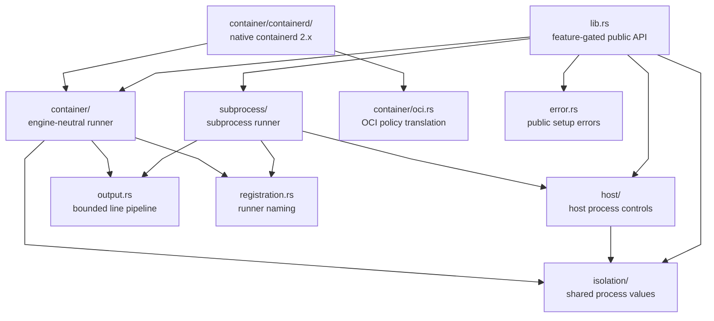

The arrows show direct use.
They do not represent runtime ownership.

| Module                          | Owns                                                                  | Does not own                                      |
|---------------------------------|-----------------------------------------------------------------------|---------------------------------------------------|
| `lib.rs`                        | Feature-gated exports and crate-level documentation                   | Routing, scheduling, or task state                |
| `isolation/`                    | Shared capability, credential, resource, and seccomp values           | Native enforcement                                |
| `host/`                         | Host policy preparation, child hooks, cgroups, and process domains    | Workload resolution or process supervision        |
| `subprocess/backend.rs`         | Environment, cwd, output, script, descriptor, and host settings       | Attempt lifecycle                                 |
| `subprocess/task.rs`            | Immutable settings resolved for one reusable Taskvisor task           | Attempt-scoped operating-system resources         |
| `subprocess/boundary.rs`        | Pinned working-directory handles                                      | Filesystem confinement after process start        |
| `subprocess/script.rs`          | Attempt-scoped script transport                                       | Interpreter selection                             |
| `subprocess/runner.rs`          | Workload conversion and subprocess attempt orchestration              | Router selection or restart policy                |
| `subprocess/domain.rs`          | Child, process-group identity, host domain, reap, and drop finalizer   | Task result policy                                |
| `container/engine.rs`           | Engine and attempt contracts                                          | A concrete engine protocol                        |
| `container/runner.rs`           | Workload conversion and engine-neutral attempt orchestration          | Image, snapshot, or runtime implementation        |
| `container/policy.rs`           | Engine-neutral container process policy                               | OCI or host-process enforcement                   |
| `container/oci.rs`              | Translation of container process policy into OCI fields               | Base OCI specification                            |
| `container/containerd/`         | Containerd probe, image, spec, attempt I/O, ownership, and cleanup     | Daemon lifecycle, CRI, CNI, or foreign resources  |
| `output.rs`                     | Bounded line decoding, tracing, and `OutputSink` publication           | Output retention or subscriptions                 |
| `registration.rs`               | Runner-name validation and the standard runner label                  | GVK and selector routing                          |
| `error.rs`                      | Registration and backend-construction errors                          | Attempt failure policy                            |

## Feature boundaries

No feature is enabled by default.
Each execution path is opt-in.

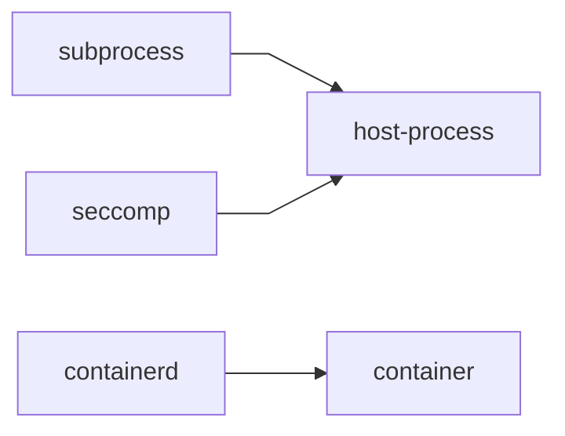

| Feature        | Exposes                                            | Platform boundary                                      |
|----------------|----------------------------------------------------|--------------------------------------------------------|
| `host-process` | Host policy and low-level process controls         | Unix and Linux controls are validated before use       |
| `subprocess`   | `SubprocessRunner`                                 | Uses the strongest available host process boundary     |
| `seccomp`      | Host seccomp enforcement                           | The BPF renderer is available on Linux                 |
| `container`    | `ContainerRunner` and engine contracts             | The contract does not select a platform or engine      |
| `containerd`   | Native containerd 2.x adapter                      | Container execution and attempt FIFOs require Linux    |

`container` does not imply `containerd`.
A final binary may provide another `ContainerEngine` implementation.

`containerd` compiles outside Linux.
Attempt I/O returns an unsupported-platform error there.

## Build and attempt boundaries

Both runners build reusable `TaskRef` values.
Taskvisor owns execution after the build.

```mermaid
%%{init: {"flowchart": {"curve": "linear"}}}%%
flowchart LR
    Task["solti_model::Task"]
    Router["RunnerRouter<br/>GVK + selector"]
    Build["Runner::build_task"]
    Config["Immutable task settings"]
    TaskRef["taskvisor::TaskRef"]
    Spawn["Taskvisor attempt"]
    Resources["Fresh attempt resources"]
    Result["Task result + cleanup"]

    Task --> Router
    Router --> Build
    Build --> Config
    Config --> TaskRef
    TaskRef --> Spawn
    Spawn --> Resources
    Resources --> Result
```

The build checks the exact built-in workload GVK.
It merges task and runner environment values.
It does not spawn a process or call a container engine.

The subprocess build decodes script bodies and pins an explicit cwd.
The container build stores image overrides and process policy.

Every Taskvisor attempt receives fresh runtime resources.
The same `TaskRef` can therefore run more than once.

## Isolation translation

`isolation/` defines values shared by process-based backends.
It does not apply them.

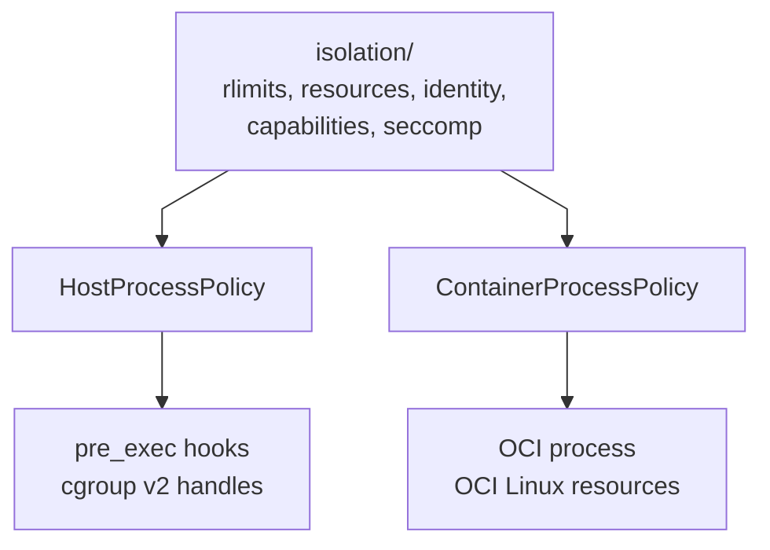

`HostProcessPolicy` and `ContainerProcessPolicy` are separate policies.
They reuse value types but have different enforcement semantics.

| Shared value         | Host translation                                      | Container translation                                  |
|----------------------|-------------------------------------------------------|--------------------------------------------------------|
| `RlimitConfig`       | Clamped against inherited hard limits before spawn    | Replaces selected OCI rlimit entries                   |
| `CgroupLimits`       | Creates and owns one cgroup v2 child per attempt       | Updates selected OCI Linux resource fields             |
| `ProcessCredentials` | Applies exact IDs between `fork` and `execve`          | Replaces the OCI process user                          |
| `LinuxCapability`    | Reduces the host capability boundary                  | Replaces all five OCI capability sets                  |
| `SeccompPolicy`      | Installs a host BPF filter                             | Builds OCI named syscall rules                         |

The host seccomp renderer also rejects the x32 syscall ABI on LP64 `x86_64`.
OCI named syscall rules cannot express that raw-number guard.

An empty host policy adds no host control.
An empty container policy preserves the engine's base OCI specification.
Configured controls are validated before enforcement.

## Host process preparation

Host controls use a two-stage preparation boundary.

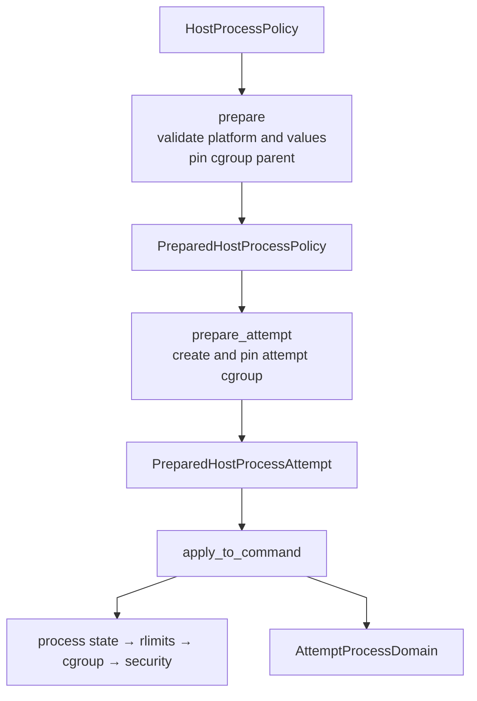

Runner construction validates platform support and static values.
It resolves the inherited or explicit cgroup parent.

Attempt preparation creates the child cgroup before process creation.
The returned token proves that configured attempt resources were prepared.

`apply_to_command` installs child hooks and returns the owning process domain.
A configured hook failure prevents `execve`.

The backend owns its process-specific termination boundary.
`AttemptProcessDomain` owns only the optional cgroup boundary.
It removes that cgroup only after `cgroup.events` reports `populated 0`.

These controls harden host processes.
They do not form a complete sandbox for untrusted code.

## Subprocess lifecycle

`SubprocessRunner` separates runner construction, task build, and attempt execution.

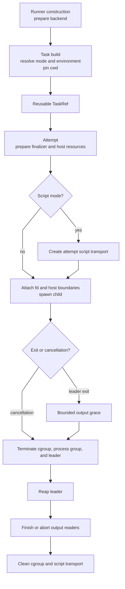

Command mode starts the configured executable directly.
Script mode stores decoded bytes in fresh attempt-scoped transport.

Linux uses a sealed anonymous `memfd`.
Other Unix platforms use an unlinked file.
Non-Unix platforms use a named temporary file.

Unix attempts own a session and process group.
A configured cgroup is an additional boundary.
Termination requests every available boundary before the leader is reaped.

Normal leader exit receives the same descendant cleanup.
This prevents descendants from retaining output pipes or attempt resources.

Lifecycle termination, reap, and cleanup errors are fatal.
Exit status is evaluated only after lifecycle cleanup succeeds.

## Dropped subprocess attempts

`ActiveProcessDomain` owns the child wait status.
It keeps the Unix process-group identity reserved until termination.

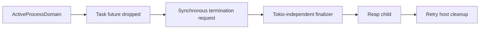

Drop does not wait for process exit.
It transfers the child, host domain, and process-group state to one finalizer worker.

The worker retains the child until it reaps it or detects lost wait ownership.
It then advances host cleanup outside the attempt's Tokio runtime.

The embedding process must not reap arbitrary children.
It must not enable automatic `SIGCHLD` reaping.

## Container engine boundary

`ContainerRunner` owns the engine-neutral lifecycle.
`ContainerEngine` owns engine-specific creation.

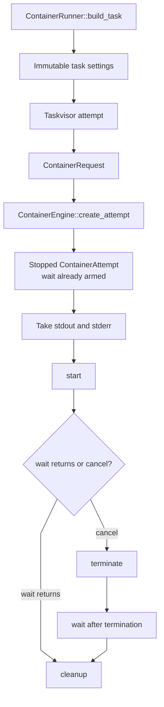

`probe` is explicit.
The runner never calls it.

`create_attempt` returns a stopped attempt.
Exit observation must be armed before the attempt is returned.

`terminate` and `cleanup` are idempotent.
Cleanup may remove only attempt-owned resources.
Completed cleanup steps remain completed across retries.

The runner executes the lifecycle in a worker task.
Closing its cancellation channel makes the worker terminate and clean the attempt.

Retryable create, start, and wait errors become retryable Taskvisor failures.
Permanent errors become fatal Taskvisor failures.
Termination and cleanup errors are always fatal.

## Native containerd lifecycle

`ContainerdEngine` implements the generic boundary against native containerd 2.x services.
It uses one explicit Unix socket and namespace.

Connection probes:

- containerd major version 2;
- the configured snapshotter;
- the selected platform;
- the configured OCI runtime.

The adapter never scans for sockets or starts a daemon.
It does not use CRI or configure CNI.

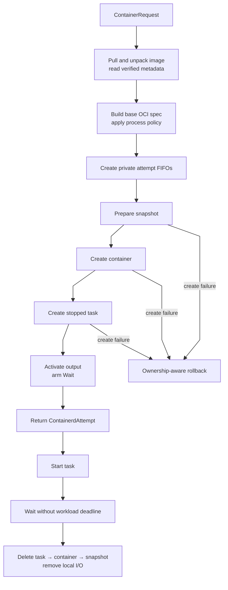

Image transfer has a separate 10-minute deadline by default.
Control and metadata RPCs use a 30-second deadline by default.
Both the gRPC request and the local future enforce finite deadlines.

Content reads share one control deadline across the complete stream.
Each image metadata object is limited to 4 MiB.
The adapter verifies descriptor size, stream offsets, and digest.

The workload `Wait` RPC has no deadline.
Only service readiness before it is sent uses the control timeout.

## OCI specification

`containerd/spec.rs` builds the base Linux specification.
`container/oci.rs` applies explicit runner policy after that base.

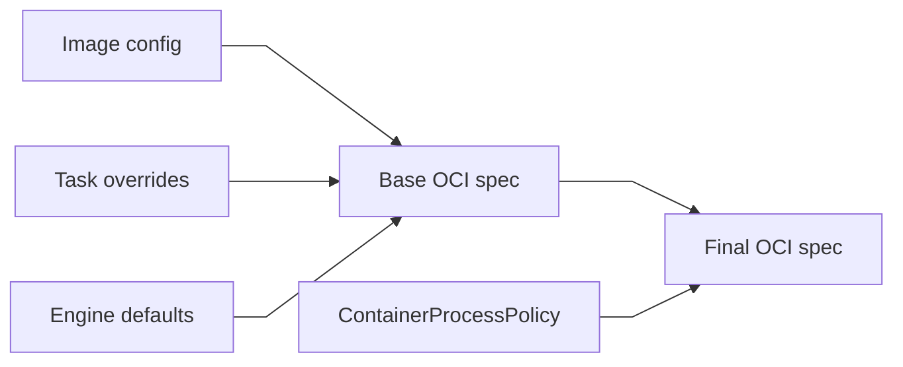

Task command and argument overrides follow Kubernetes container rules.
Task and runner environment values override image values.

The base creates PID, IPC, UTS, and mount namespaces.
`ContainerNetwork::None` also creates a network namespace.
`ContainerNetwork::Host` omits that namespace.

Neither mode provisions an interface, address, route, DNS, NAT, or CNI.
The network mode does not change OCI capabilities.

An empty `ContainerProcessPolicy` preserves the base policy.
Configured values replace only their owned OCI fields.

## Containerd ownership and cleanup

One `ContainerdEngine` receives a random session identifier.
Each native attempt receives a monotonic resource ID within that session.
The snapshot, container, and task share that resource ID.

Snapshot and container records carry labels for:

- manager;
- engine session;
- resource ID;
- model task name;
- generation;
- attempt.

The adapter tracks each remote resource separately.

| State       | Meaning                                             | Cleanup action                            |
|-------------|-----------------------------------------------------|-------------------------------------------|
| `Absent`    | The resource is known not to exist                  | Do not delete                             |
| `Foreign`   | The resource exists but does not match this attempt | Never delete                              |
| `Owned`     | Creation or read-back confirmed this attempt        | Delete after dependent resources are gone |
| `Uncertain` | A create outcome could not be confirmed             | Read back before any delete               |

Timeouts and transient create errors are ambiguous outcomes.
They enter `Uncertain` before read-back.

Snapshot identity includes its parent and ownership labels.
Container identity includes its snapshotter, snapshot key, and ownership labels.
Task identity requires the confirmed owned container.

Cleanup follows dependency order:

1. terminate and delete the task;
2. delete the container;
3. remove the snapshot;
4. remove local attempt I/O.

Retryable cleanup errors use exponential backoff from 100 milliseconds to 2 seconds.
Every retry shares one 30-second window by default.
A permanent error stops retry.

The same cleanup path handles normal completion and failed-create rollback.
Incomplete rollback is reported with both creation and cleanup failures.

Linux attempt I/O uses one private `0700` directory and two `0600` FIFOs.
The configured root must be visible at the same path to the SDK process and containerd.
Writable shared path components require the sticky bit.

## Output path

Subprocess and container attempts use the same line pipeline.

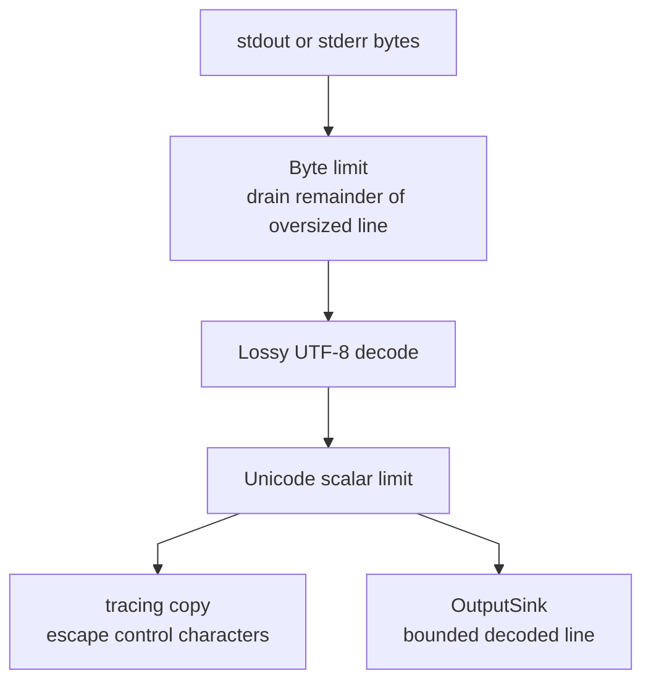

Stdout and stderr are independent streams.
Invalid UTF-8 uses replacement characters.

Tracing escapes control characters except tab.
The output sink receives the unsanitized bounded line.

The crate publishes live output only when the build context provides a sink.
It does not retain output.

## Failure boundaries

Each layer owns one error contract.

| Boundary                           | Error                              | Meaning                                      |
|------------------------------------|------------------------------------|----------------------------------------------|
| Registration and runner setup      | `ExecError`                        | Invalid config, router rejection, or host I/O |
| Workload build                     | `solti_runner::RunnerError`        | Invalid or unsupported workload              |
| Container engine operation         | `ContainerEngineError`             | Retryable or permanent engine failure        |
| Attempt execution                  | `taskvisor::TaskError`             | Success, retryable, fatal, or canceled result |

Diagnostic text does not select retry policy.
Typed error classes and operating-system error kinds do.

Cleanup failures are fatal for the current attempt.
They cannot be hidden by cancellation or an earlier execution result.

## Where to make a change

| Change                                  | Start here                                                                                                                       | Verify here                                      |
|-----------------------------------------|----------------------------------------------------------------------------------------------------------------------------------|--------------------------------------------------|
| Public exports or feature boundary      | [`src/lib.rs`](src/lib.rs), [`Cargo.toml`](Cargo.toml)                                                                           | feature checks and rustdoc                       |
| Shared isolation value                  | [`src/isolation/`](src/isolation)                                                                                                | isolation, host, and container policy tests      |
| Host policy preparation                 | [`src/host/policy.rs`](src/host/policy.rs)                                                                                        | host policy tests                                |
| Process state or rlimits                | [`src/host/process.rs`](src/host/process.rs), [`src/host/limits.rs`](src/host/limits.rs)                                          | process and limit tests                          |
| Cgroup ownership or cleanup             | [`src/host/cgroups.rs`](src/host/cgroups.rs)                                                                                      | cgroup and process-domain tests                  |
| Host identity, capabilities, or seccomp | [`src/host/security.rs`](src/host/security.rs), [`src/host/capability.rs`](src/host/capability.rs)                                | security and capability tests                    |
| Subprocess settings, env, or cwd        | [`src/subprocess/backend.rs`](src/subprocess/backend.rs), [`src/subprocess/boundary.rs`](src/subprocess/boundary.rs)              | backend and boundary tests                       |
| Command or script materialization       | [`src/subprocess/runner.rs`](src/subprocess/runner.rs), [`src/subprocess/script.rs`](src/subprocess/script.rs)                    | runner and script tests                          |
| Subprocess termination or drop          | [`src/subprocess/domain.rs`](src/subprocess/domain.rs), [`src/subprocess/runner.rs`](src/subprocess/runner.rs)                    | domain and cancellation tests                    |
| Generic container lifecycle             | [`src/container/engine.rs`](src/container/engine.rs), [`src/container/runner.rs`](src/container/runner.rs)                       | container runner tests                           |
| Container process policy                | [`src/container/policy.rs`](src/container/policy.rs), [`src/container/oci.rs`](src/container/oci.rs)                             | policy and OCI tests                             |
| Containerd config or probe              | [`src/container/containerd/config.rs`](src/container/containerd/config.rs), [`src/container/containerd/engine.rs`](src/container/containerd/engine.rs) | config and probe tests                           |
| Image resolution or metadata            | [`src/container/containerd/image.rs`](src/container/containerd/image.rs)                                                         | image tests                                      |
| Containerd ownership or lifecycle       | [`src/container/containerd/engine.rs`](src/container/containerd/engine.rs)                                                       | engine ownership and cleanup tests               |
| OCI base specification                  | [`src/container/containerd/spec.rs`](src/container/containerd/spec.rs)                                                           | spec tests                                       |
| Containerd output pipes                 | [`src/container/containerd/io.rs`](src/container/containerd/io.rs)                                                               | Linux I/O tests                                  |
| Shared output behavior                  | [`src/output.rs`](src/output.rs)                                                                                                 | output tests                                     |
| Runner registration                     | [`src/registration.rs`](src/registration.rs), [`src/error.rs`](src/error.rs)                                                     | runner registration tests                        |
| User-facing usage                       | [`README.md`](README.md), [`src/lib.rs`](src/lib.rs)                                                                              | README and rustdoc doctests                      |

## Invariants to preserve

Before changing an execution path, check these constraints in the owning module and its tests:

1. Default features remain empty.
2. Each runner accepts only its exact built-in workload GVK.
3. `solti-runner` remains responsible for GVK and selector routing.
4. Building a task does not spawn a process or call a container engine.
5. One reusable `TaskRef` creates fresh resources for every attempt.
6. Shared isolation values remain separate from native enforcement.
7. Host and OCI policies translate shared values independently.
8. Configured security and resource controls fail closed.
9. Host process controls are not presented as a complete sandbox.
10. The subprocess domain retains exclusive ownership of child wait status.
11. Every available subprocess termination boundary is handled before leader reap.
12. Dropping a subprocess task cannot abandon child reap and host cleanup.
13. Output byte and character limits remain bounded before publication.
14. Only the tracing copy escapes control characters.
15. The generic container runner does not select a concrete engine.
16. A returned `ContainerAttempt` is stopped and has exit observation armed.
17. Container termination and cleanup remain idempotent.
18. Container cleanup removes only resources owned by the current attempt.
19. Native containerd remains fixed to major version 2 and one explicit socket.
20. Native containerd does not discover daemons, use CRI, or configure CNI.
21. Image metadata remains bounded and digest-verified.
22. `ContainerNetwork::None` and `Host` differ only in network namespace selection.
23. Ambiguous create outcomes require ownership read-back.
24. Foreign containerd resources are never deleted.
25. Containerd cleanup preserves task, container, and snapshot dependency order.
26. Output remains live-only and execution state remains outside this crate.

When a change crosses one of these boundaries, update the owning module documentation and the relevant diagram in this guide.
