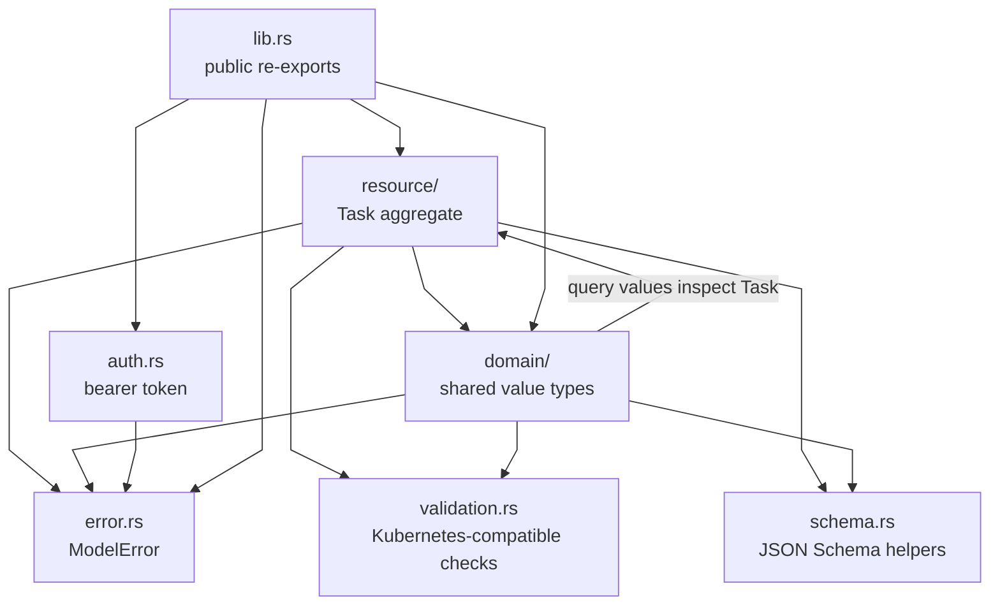
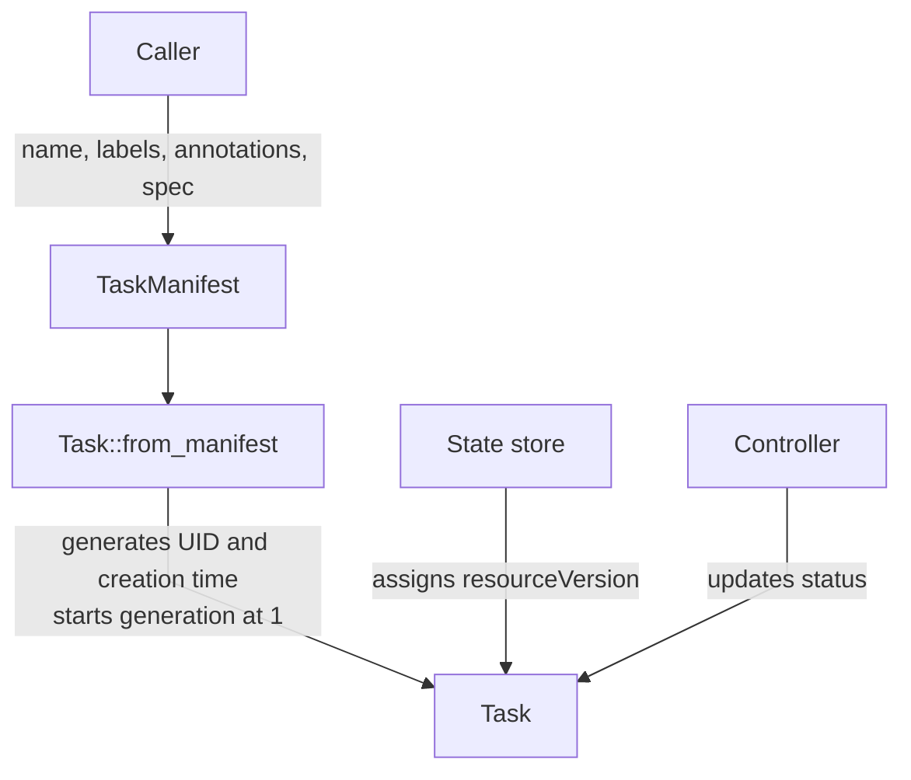
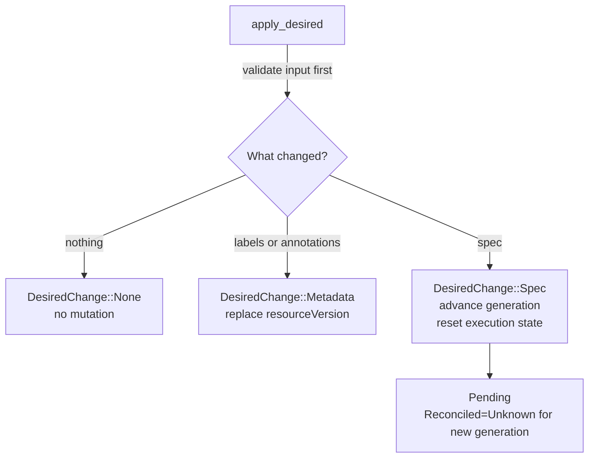
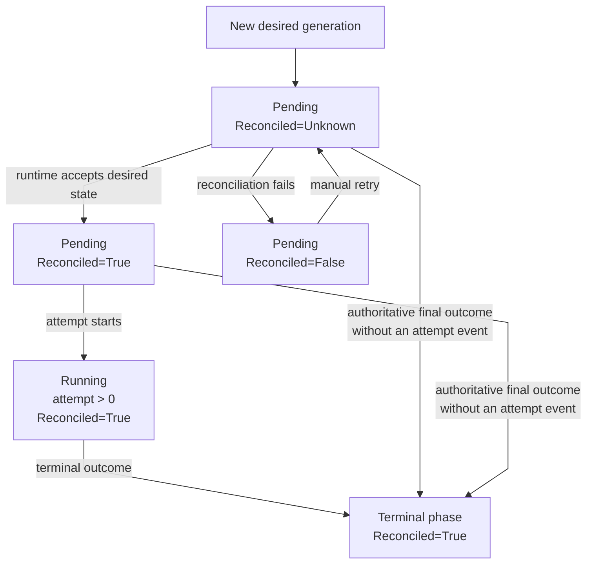
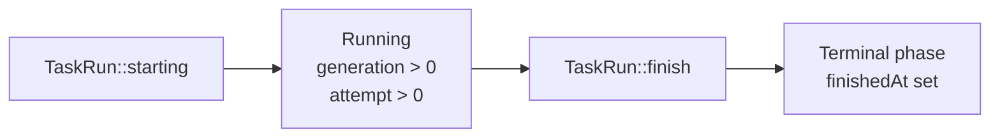
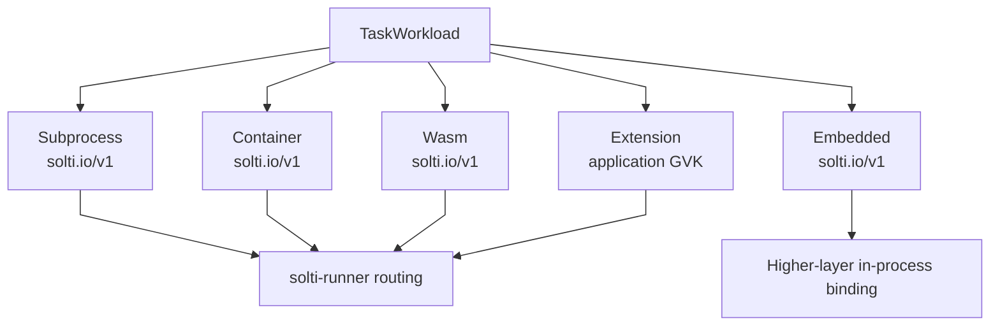
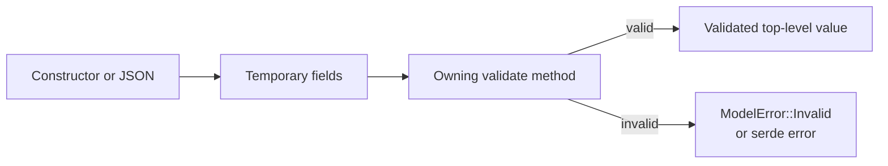
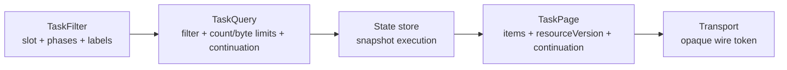
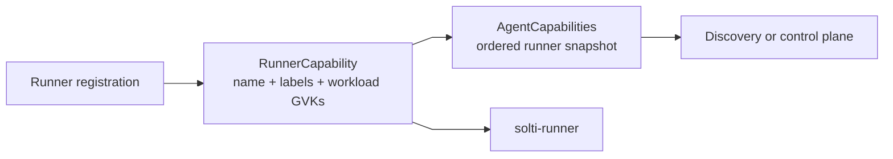

# solti-model source guide

This document is a reading map for contributors.

It shows which module owns each contract and how values move through the model.
The Rust source and its module-level documentation remain the source of truth.

## Crate map

`lib.rs` exposes one flat public API.
The internal modules keep ownership explicit.

The arrows show direct use.
They do not represent runtime ownership.

`domain/query` is the only domain area that directly reads `Task`.
It models collections over stored resources.

| Module                      | Owns                                                             | Does not own                                   |
|-----------------------------|------------------------------------------------------------------|------------------------------------------------|
| `resource/task.rs`          | Task GVK, manifest materialization, apply, lifecycle transitions | Storage, reconciliation scheduling, execution  |
| `resource/metadata.rs`      | UID, resource version, generation, creation timestamp            | Persistence or version allocation              |
| `resource/preconditions.rs` | Optional UID and resource-version checks for writes              | Evaluating a write against stored state        |
| `resource/spec.rs`          | Required fields, defaults, structural spec validation            | Runner availability                            |
| `resource/status.rs`        | Status shape and cross-field invariants                          | Event collection or retry scheduling           |
| `resource/condition.rs`     | Extensible condition shape and `Reconciled` condition values     | Controller logic                               |
| `resource/run.rs`           | One active or finished attempt record                            | Run history storage                            |
| `domain/kind/`              | Built-in and extension workload envelopes                        | Workload execution                             |
| `domain/selector/`          | Kubernetes-style label matching                                  | Runner registration                            |
| `domain/query/`             | Filters, pagination domain values, watch event values            | Snapshot retention or watch transport          |
| `domain/capability.rs`      | Immutable runner capability snapshots                            | Routing decisions                              |
| `domain/output.rs`          | Live-output data and JSON encoding                               | Channels, retention, subscriptions             |
| `auth.rs`                   | Secret loading, generation, redaction, comparison                | Authentication topology, persistence, rotation |
| `schema.rs`                 | JSON Schema shapes for custom wire encodings                     | OpenAPI routes or transport behavior           |
| `validation.rs`             | Shared syntax checks                                             | Product admission policy                       |

## Resource ownership

`TaskManifest` is the write-side input.
`Task` is the stored resource.

| Field                                  | Owner             |
|----------------------------------------|-------------------|
| `apiVersion` and `kind`                | Model             |
| `metadata.name`                        | Caller            |
| `metadata.labels` and `annotations`    | Caller            |
| `spec`                                 | Caller            |
| `metadata.uid`                         | Model/store       |
| `metadata.resourceVersion`             | State store       |
| `metadata.generation`                  | Model/store       |
| `metadata.creationTimestamp`           | Model/store       |
| `status`                               | Controller        |

`TaskManifest` deliberately cannot represent status or server-owned metadata.
This keeps create and apply input separate from observed state.

`Task::from_parts` is the reconstruction boundary for a stored value.
It validates the complete resource before returning it.

## Desired-state apply

`Task::apply_desired` compares caller-owned metadata and spec.
It does not compare server-owned fields.

Apply preserves UID and creation time.
A metadata-only change preserves generation and status.
A spec change advances generation and resets phase, attempt, exit code, and lifecycle error.
At `u64::MAX`, a spec change returns `ModelError::Invalid` without mutating the resource.
The previous `status.observedGeneration` is retained until the new generation is processed.

An identical apply is a true no-op.
It does not consume the supplied resource version.

## Reconciliation and execution state

`TaskStatus` contains two related views:

- `Reconciled` reports desired-state reconciliation;
- `phase`, `attempt`, `exitCode`, and `error` report execution.

Generation is checked before every attempt or terminal transition.
A stale generation returns without mutation.
Attempt numbers are authoritative inputs.
The model does not synthesize a missing attempt number.
A terminal phase records a logical outcome. It does not by itself prove that
non-cooperative execution code has exited physically.

`transition_finished` applies attempt-level sticky semantics.
An identical or older terminal attempt is ignored.
`Failed` may be refined to `Timeout` or `Exhausted`.

`reconcile_finished` records an authoritative task-level outcome.
It may replace a conflicting terminal attempt phase.
It preserves the latest observed attempt because the task-level outcome has no attempt field.

### Status invariants

`TaskStatus::from_parts` and direct deserialization enforce:

1. Exactly one `Reconciled` condition exists.
2. Condition types are unique.
3. `Reconciled.observedGeneration` is greater than zero.
4. `Reconciled.observedGeneration` cannot be lower than `status.observedGeneration`.
5. `Reconciled=True` and `Reconciled=False` use the same generation as `status.observedGeneration`.
6. Running and terminal phases require `Reconciled=True`.
7. Pending uses attempt zero and has no execution diagnostics.
8. Running uses a positive attempt and has no terminal diagnostics.
9. A terminal status may use attempt zero when no attempt event was observed.
10. `error` is a UTF-8-safe prefix of at most 32 KiB.

`Task::validate` adds the resource-level bounds:

1. `status.observedGeneration` cannot exceed `metadata.generation`.
2. A condition generation cannot exceed `metadata.generation`.

`lastTransitionTime` changes only when the condition status changes.
A reason, message, or generation update with the same status preserves it.

## Task runs

`TaskStatus` is the latest resource view.
`TaskRun` is one execution attempt.

An active run has no finish fields.
A terminal run requires `finishedAt`.
That timestamp records the supervisor's logical outcome. It does not prove
physical exit after a force-abort.
The run snapshots its workload GVK.
Its `error` uses the same UTF-8-safe 32 KiB prefix contract as
`TaskStatus.error`.

The model does not retain runs.
A state store decides whether and how long to keep them.

`TaskRunQuery` applies a default page size of 100 and a hard maximum of 1000.
`TaskRunContinuation` binds a snapshot to Task name, Task UID, resource
version, generation, and attempt. `TaskRunPage` carries the same Task identity
so a transport can shorten a native-encoded prefix without weakening the cursor.

## Workload type system

Every workload uses a Kubernetes-style envelope:

- `apiVersion`;
- `kind`;
- `spec`.

Built-in variants have fixed kinds and strict specs.
Unknown built-in fields are rejected.

`ExtensionWorkload` preserves an application-owned JSON object.
Its GVK must use a grouped CRD-style API version.
The `solti.io` group is reserved for built-in workloads.

`EmbeddedSpec` contains only the caller-owned implementation revision.
A higher layer binds that revision to an in-process task handle.
Embedded workloads do not participate in runner capabilities.

## Validation boundary

The crate uses validated domain values at resource boundaries.
Some mutable collection types remain temporarily constructible before validation.

| Boundary                                      | Validation owner                                |
|-----------------------------------------------|-------------------------------------------------|
| `TaskManifest` and `Task`                     | Complete GVK, metadata, spec, status validation |
| `TaskSpec`                                    | Slot, timeout, workload, backoff, selector      |
| `TaskStatus`                                  | Conditions, generations, lifecycle fields       |
| `TaskRun`                                     | Generation, attempt, phase, finish fields       |
| `RunnerCapability` and `AgentCapabilities`    | Names, labels, GVKs, uniqueness                 |
| `TaskFilter` and `TaskContinuation`           | Selector and cursor fields                      |
| `WorkloadTypeMeta` and extension workloads    | CRD-compatible GVK                              |

Direct construction or deserialization does not validate `Labels`, `Annotations`, `LabelSelector`, or `SelectorRequirement`.
Call their `validate` methods before using them outside a top-level validated boundary.

A `BackoffPolicy` struct literal also requires `validate`.
Its direct deserialization validates automatically.

`TaskEnv` deliberately stores application-owned key-value pairs without validation.
Execution layers decide which names and values they support.

The `schema` feature describes serialized structure.
It also encodes local field constraints and lifecycle branches.

Runtime validation and normalization remain authoritative for relationships
that standard JSON Schema cannot express exactly. These include generation
comparisons, uniqueness by condition type, backoff field ordering, and UTF-8
byte budgets. Schema `maxLength` bounds the number of Unicode code points;
runtime diagnostic truncation bounds encoded UTF-8 bytes.

## Queries and collections

The model defines query values.
The state store owns snapshot retention and query execution.

Filters run before pagination.
Multiple phases use OR semantics.
Slot, phase, and label filters use AND semantics.
Pages keep a complete-item prefix within both limits.
An oversized first item is returned alone for native transport measurement.

`TaskContinuation` fixes:

- the collection resource version;
- the original filter;
- the last returned task name.

The resource version stays opaque in the model.
The state store checks whether the referenced snapshot is still available.
Transport layers encode the continuation into their own token.

`TaskWatchEvent` carries `Added`, `Modified`, or `Deleted`.
The model does not open or retain a watch stream.

## Capabilities and routing

Capability values describe registrations.
They do not perform routing.

Runner names use Kubernetes label-value rules.
Runner labels are the labels matched by `runnerSelector`.
Workload GVKs are sorted into canonical order.
Runner registration order is preserved across `AgentCapabilities`.

The model rejects duplicate runner names and duplicate GVKs.
It also rejects the built-in Embedded GVK.
`solti-runner` owns the final GVK and selector routing decision.

## Data-only contracts

Several public types are shared contracts without an owned runtime:

| Type             | Model owns                                | Higher layer owns                               |
|------------------|-------------------------------------------|-------------------------------------------------|
| `OutputEvent`    | Binary chunks, truncation and lag byte counts, JSON encoding | Publication, channels, lag detection, retention |
| `TaskRun`        | One attempt record and invariants         | History storage and retention                   |
| `TaskQuery`      | Filter and pagination values              | Snapshot execution                              |
| `TaskWatchEvent` | Added, modified, and deleted values       | Watch lifecycle and delivery                    |
| `Token`          | Secret loading, redaction, comparison     | Auth policy, persistence, rotation              |
| `TaskWorkload`   | Desired-state envelope                    | Runner selection and execution                  |

Keep this boundary when extending the model.
Runtime behavior belongs in the crate that owns that runtime.

## Where to make a change

| Change                                      | Start here                                                                                                                                       | Verify here                                      |
|---------------------------------------------|--------------------------------------------------------------------------------------------------------------------------------------------------|--------------------------------------------------|
| Public exports                              | [`src/lib.rs`](src/lib.rs)                                                                                                                       | rustdoc and README doctests                      |
| Task wire shape or resource ownership       | [`src/resource/task.rs`](src/resource/task.rs), [`src/resource/metadata.rs`](src/resource/metadata.rs)                                           | task module tests and `tests/serde_roundtrip.rs` |
| Conditional write contract                  | [`src/resource/preconditions.rs`](src/resource/preconditions.rs)                                                                                 | precondition tests                               |
| Spec fields or defaults                     | [`src/resource/spec.rs`](src/resource/spec.rs)                                                                                                   | spec tests and README defaults                   |
| Built-in or extension workload              | [`src/domain/kind/`](src/domain/kind)                                                                                                            | kind tests and `tests/serde_roundtrip.rs`        |
| Phase or status transition                  | [`src/resource/status.rs`](src/resource/status.rs), [`src/resource/task.rs`](src/resource/task.rs), [`src/domain/phase.rs`](src/domain/phase.rs) | status and task tests                            |
| Condition semantics                         | [`src/resource/condition.rs`](src/resource/condition.rs)                                                                                         | condition and status tests                       |
| Attempt record                              | [`src/resource/run.rs`](src/resource/run.rs)                                                                                                     | run tests and `tests/serde_roundtrip.rs`         |
| Label or selector rules                     | [`src/domain/label.rs`](src/domain/label.rs), [`src/domain/selector/`](src/domain/selector)                                                      | label and selector tests                         |
| Query or continuation                       | [`src/domain/query/task.rs`](src/domain/query/task.rs)                                                                                           | query tests                                      |
| Runner capability contract                  | [`src/domain/capability.rs`](src/domain/capability.rs)                                                                                           | capability tests                                 |
| Output event JSON                           | [`src/domain/output.rs`](src/domain/output.rs)                                                                                                   | output wire-shape tests                          |
| Bearer token                                | [`src/auth.rs`](src/auth.rs)                                                                                                                     | auth tests                                       |
| Shared validation syntax                    | [`src/validation.rs`](src/validation.rs)                                                                                                         | validation tests and every affected owner        |
| User-facing usage                           | [`README.md`](README.md), [`src/lib.rs`](src/lib.rs)                                                                                             | `cargo test -p solti-model --doc`                |

## Invariants to preserve

Before changing a shared contract, check these constraints in the owning module and its tests:

1. `TaskManifest` contains only caller-owned desired state.
2. `Task` uses the fixed `solti.io/v1` and `Task` GVK.
3. UID and creation time survive every apply.
4. Metadata-only apply does not change generation or status.
5. Spec apply advances generation and resets execution state.
6. Stale generation transitions do not mutate a task.
7. Attempt numbers come from the execution source of truth.
8. Reconciliation errors stay in the `Reconciled` condition.
9. Execution errors stay in terminal status or run diagnostics.
10. Built-in workload shapes are strict.
11. Extension workload fields remain application-owned.
12. Embedded remains valid in the model and absent from runner capabilities.
13. Filters run before pagination.
14. Continuations remain bound to one filter and snapshot version.
15. Output, query, auth, and run-history runtimes stay outside this crate.

When a change crosses one of these boundaries, update the owning module documentation and the relevant diagram in this guide.
