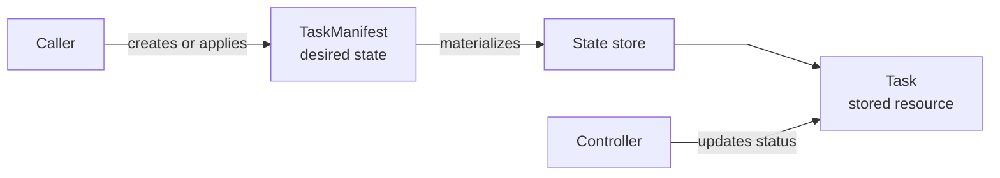

# solti-model

`solti-model` is the shared data contract for Solti agents, APIs, runners, and control planes.

It defines task resources, workloads, policies, selectors, capabilities, queries, output events, identities, and bearer tokens.
It validates data but does not store, route, or execute tasks.

The default `schema` feature implements `schemars::JsonSchema` for resource, workload, selector, capability, and output types.
Disable default features when schema generation is not needed.

## Choose an entry point

| Goal                              | Start with                                      |
|-----------------------------------|-------------------------------------------------|
| Submit or apply desired state     | `TaskManifest`                                  |
| Describe task execution           | `TaskSpec` and `TaskWorkload`                   |
| Work with a stored resource       | `Task`                                          |
| Guard a write against stale state | `WritePreconditions`                            |
| Record one execution attempt      | `TaskRun`                                       |
| Filter or paginate tasks          | `TaskFilter`, `TaskQuery`, `TaskContinuation`   |
| Paginate one task's runs          | `TaskRunQuery`, `TaskRunContinuation`           |
| Match runner labels               | `LabelSelector`                                 |
| Advertise agent capabilities      | `RunnerCapability`, `AgentCapabilities`         |
| Read live output                  | `OutputEvent`                                   |
| Load or verify a bearer secret    | `Token`                                         |

## Quick start

Build caller-owned desired state:

```rust
use solti_model::{
    Flag, Labels, SubprocessMode, SubprocessSpec, TaskEnv, TaskManifest,
    TaskSpec, TaskWorkload,
};

let workload = TaskWorkload::Subprocess(SubprocessSpec::new(
    SubprocessMode::Command {
        command: "echo".into(),
        args: vec!["hello".into()],
    },
    TaskEnv::default(),
    None,
    Flag::enabled(),
));

let spec = TaskSpec::builder("jobs", workload, 5_000_u64)
    .build()
    .expect("valid task spec");

let mut labels = Labels::new();
labels.insert("app.kubernetes.io/name", "hello");

let manifest = TaskManifest::new("hello-1", spec)
    .unwrap()
    .with_labels(labels)
    .unwrap();

assert_eq!(manifest.name().as_str(), "hello-1");
assert_eq!(manifest.slot().as_str(), "jobs");
```

`TaskManifest` contains only caller-owned fields.
Use it at create and apply boundaries.

## Resource types



`TaskManifest` contains:

- `apiVersion` and `kind`;
- `metadata.name`;
- labels and annotations;
- `spec`.

`Task` adds:

- `metadata.uid`;
- `metadata.resourceVersion`;
- `metadata.generation`;
- `metadata.creationTimestamp`;
- `status`.

Both use `apiVersion: solti.io/v1` and `kind: Task`.
`TaskManifest` rejects server-owned metadata and status.

Use `Task::from_manifest` when implementing a state store:

```rust
use solti_model::{EmbeddedSpec, Task, TaskManifest, TaskSpec, TaskWorkload};

let workload = TaskWorkload::Embedded(
    EmbeddedSpec::new("cleanup-v1").unwrap(),
);
let spec = TaskSpec::builder("maintenance", workload, 5_000_u64)
    .build()
    .unwrap();
let manifest = TaskManifest::new("cleanup", spec).unwrap();
let task = Task::from_manifest(manifest).unwrap();

assert_eq!(task.metadata().generation(), 1);
assert_eq!(task.status().observed_generation(), 0);
assert!(task.metadata().resource_version().is_empty());
```

The model generates the UID and creation timestamp.
The state store assigns the resource version.

## Guard writes

`WritePreconditions` protects an apply, cancel, or delete from a stale resource snapshot.

Use `WritePreconditions::from_task` to capture both UID and resource version:

```rust
use solti_model::{
    EmbeddedSpec, Task, TaskSpec, TaskWorkload, WritePreconditions,
};

let workload = TaskWorkload::Embedded(EmbeddedSpec::new("v1").unwrap());
let spec = TaskSpec::builder("jobs", workload, 1_000_u64)
    .build()
    .unwrap();
let mut task = Task::new("cleanup", spec).unwrap();
task.set_resource_version("7").unwrap();

let preconditions = WritePreconditions::from_task(&task).unwrap();

assert_eq!(preconditions.uid(), Some(task.uid()));
assert_eq!(preconditions.resource_version(), Some("7"));
```

The model captures the expected values.
The state store or API enforces them against the current resource.

## Task specification

`TaskSpec::builder` requires:

| Field      | Meaning                        |
|------------|--------------------------------|
| `slot`     | Admission and concurrency lane |
| `workload` | Executable desired state       |
| `timeout`  | Positive attempt timeout in ms |

The builder applies:

| Field            | Default                                       |
|------------------|-----------------------------------------------|
| `restart`        | `RestartPolicy::Never`                        |
| `backoff`        | Full jitter, 1 s to 30 s, factor 2            |
| `admission`      | `AdmissionPolicy::DropIfRunning`              |
| `maxRetries`     | Absent, which means unlimited failure retries |
| `runnerSelector` | Absent                                        |

`maxRetries` counts retries after the first failed attempt.
Zero is invalid.
Omit the field for an unlimited retry budget.

## Workloads

| Variant       | Input                                               | Runner-routed |
|---------------|-----------------------------------------------------|---------------|
| `Subprocess`  | Command or explicit interpreter and base64 script   | Yes           |
| `Container`   | OCI image, optional command, args, environment      | Yes           |
| `Wasm`        | WASM module path, args, environment                 | Yes           |
| `Embedded`    | In-process implementation revision                  | No            |
| `Extension`   | Application GVK and JSON object spec                | Yes           |

Built-in workloads use `apiVersion: solti.io/v1`.
Their envelope and spec reject unknown fields.
`Subprocess.cwd` and `Wasm.module` are wire-facing paths. A validated
`TaskSpec` requires both to be valid UTF-8. Their Unicode text is preserved
exactly by JSON and protobuf transports; the model never substitutes invalid
native path bytes.

Use `ExtensionWorkload` for an application-defined runner:

```rust
use solti_model::{ExtensionWorkload, TaskWorkload};

let workload = TaskWorkload::Extension(
    ExtensionWorkload::new(
        "media.example.io/v1",
        "ImageResize",
        serde_json::json!({
            "width": 1280,
            "format": "webp"
        }),
    )
    .unwrap(),
);

assert_eq!(workload.api_version(), "media.example.io/v1");
assert_eq!(workload.kind(), "ImageResize");
```

Extension `spec` must be a JSON object.
The `solti.io` API group is reserved for built-in workloads.
`solti-runner` owns runner selection and runner-specific validation.

Subprocess script bodies use standard base64.
Decoded content must be UTF-8.
The decoded limit is `MAX_SCRIPT_BODY_BYTES` (`2 MiB`).

## Apply desired state

`Task::apply_desired` compares labels, annotations, and spec:

| Result                    | Generation  | Status                            | Resource version |
|---------------------------|-------------|-----------------------------------|------------------|
| `DesiredChange::None`     | Unchanged   | Unchanged                         | Unchanged        |
| `DesiredChange::Metadata` | Unchanged   | Unchanged                         | Replaced         |
| `DesiredChange::Spec`     | Advanced    | Pending for the new desired state | Replaced         |

UID and creation time remain unchanged.
Invalid desired state is rejected before mutation.

Execution status transitions take an authoritative generation.
Stale generations are ignored.
Attempt numbers come from the execution source of truth.
A start transition must carry an attempt strictly newer than the latest one
recorded in status.

## Read status

`TaskStatus` combines execution state and reconciliation state.

Use:

- `phase()` for the current lifecycle phase;
- `attempt()` for the latest observed attempt;
- `observed_generation()` for the latest processed generation;
- `reconciled()` for the required `Reconciled` condition;
- `error()` and `exit_code()` for terminal diagnostics.

`TaskStatus.error` and `TaskRun.error` are stored at no more than
`MAX_TASK_DIAGNOSTIC_BYTES` (`32 KiB`) of UTF-8. Constructors,
deserialization, and lifecycle setters truncate a longer value to the longest
prefix that fits without splitting a code point. This contract does not change
`TaskCondition.message`; condition messages retain their validation contract.

`Pending` may mean that reconciliation is scheduled, failed, or accepted before execution starts.
Inspect the `Reconciled` condition to distinguish these states.

Terminal phases are `Succeeded`, `Failed`, `Timeout`, `Canceled`, and `Exhausted`.
A terminal status can have attempt zero when no attempt event was observed.
A strictly newer attempt may move terminal aggregate status back to `Running`.
Terminal `error` and `exitCode` values are optional details; they do not select
the phase.

`TaskRun.startedAt` is a recorded logical timestamp. The model validates
timestamp presence but does not require `finishedAt >= startedAt`. If
`solti-core` receives a terminal attempt without its start event, the fallback
run uses local projection time for `startedAt`, not a recovered execution start.

## Select labels

`LabelSelector` uses Kubernetes selector syntax:

```rust
use solti_model::{LabelSelector, Labels};

let selector: LabelSelector =
    "environment=production,tier in (frontend,backend),!tainted"
        .parse()
        .unwrap();

let mut labels = Labels::new();
labels.insert("environment", "production");
labels.insert("tier", "frontend");

assert!(selector.matches(&labels));
```

Requirements are ANDed.
`In` requires the key to exist.
`NotIn` and `!=` also match a missing key.

## Query tasks

`TaskFilter` contains slot, phase, and label filters.
Phases use OR semantics.
Slot, phase, and label filters are ANDed.

`TaskQuery` adds list pagination:

```rust
use solti_model::{LabelSelector, Slot, TaskQuery, DEFAULT_LIMIT};

let selector: LabelSelector = "environment=production".parse().unwrap();
let query = TaskQuery::new()
    .with_slot(Slot::new("jobs").unwrap())
    .with_active()
    .with_label_selector(selector)
    .unwrap();

assert_eq!(query.limit(), DEFAULT_LIMIT);
```

The default limit is `100`.
The maximum limit is `1000`.
Zero selects the default.
Larger values are capped.
Page items also have a 4 MiB compact-JSON budget by default.
The byte budget can return fewer items than the count limit.
The first complete item is returned even when its domain encoding is larger.
The transport then measures that item in its native encoding.

`TaskContinuation` carries the snapshot resource version, the fixed filter, and the last task name.
It is a domain value.
Transport layers encode it into their own opaque wire token.

## Advertise capabilities

`RunnerCapability` contains:

- the registered runner name;
- static labels used by `runnerSelector`;
- supported workload GVKs.

Construction rejects empty declarations, duplicate GVKs, and the built-in `Embedded` GVK.
Workload GVKs are stored in canonical order.

`AgentCapabilities` preserves runner registration order.
It rejects duplicate runner names.

## Consume output

`OutputEvent` is the shared live-output data contract:

```text
{"type":"chunk","generation":2,"attempt":1,"stream":"stdout","seq":0,"ts":1700,"line":"aGk="}
{"type":"chunk","generation":2,"attempt":1,"stream":"stdout","seq":1,"ts":1701,"line":"aA==","truncated":true}
{"type":"runStarted","generation":2,"attempt":1,"startedAt":1700}
{"type":"runFinished","generation":2,"attempt":1,"exitCode":0,"finishedAt":1701}
{"type":"lagged","skipped":42,"skippedBytes":65536}
```

Timestamps are Unix milliseconds.
Chunk bytes use standard padded base64.
They can contain non-UTF-8 data.
`truncated` reports an omitted source suffix.
`skippedBytes` reports retained payload bytes lost with lagged events.

The model does not publish, retain, or subscribe to output.
`solti-api` maps the domain events to its separate protobuf shape.

## Use bearer tokens

`Token` wraps one bearer secret:

```rust
use solti_model::Token;

let token = Token::new("secret").unwrap();

assert!(token.verify("secret"));
assert!(!token.verify("other"));
assert_eq!(format!("{token:?}"), "Token(***redacted***)");
```

`Token::generate` uses 256 bits of OS entropy and the `solti_agt_` prefix.
`Token::from_env` and `Token::from_file` load an existing value.
Generation does not persist the token.
`Debug` never exposes it.

The model does not choose an authentication topology.
It does not persist or rotate secrets.

## Validation and serde

Top-level constructors and deserializers validate their completed values.
Unknown fields are rejected by resource, spec, capability, condition, run, query, and built-in workload shapes.

Some collection types allow temporary invalid states during construction:

| Type                    | Required boundary check |
|-------------------------|-------------------------|
| `Labels`                | `validate()`            |
| `Annotations`           | `validate()`            |
| `LabelSelector`         | `validate()`            |
| `SelectorRequirement`   | `validate()`            |
| `BackoffPolicy` literal | `validate()`            |

Validated top-level APIs call these checks when the values enter a resource, query, or capability.
`TaskEnv` stores key-value pairs without validating application-specific names or values.

JSON Schema describes the serialized structure.
It covers resource GVKs, workload envelopes, selector rules, run lifecycle shapes, and capability shapes.

Runtime validation remains authoritative for semantic rules that JSON Schema cannot express exactly.
These include generation relationships, unique condition types, `maxMs >= firstMs`, and UTF-8 byte budgets.

Important limits:

- `TaskId`: Kubernetes DNS-1123 subdomain, `253` bytes;
- `Slot`: `[A-Za-z0-9._-]`, `64` bytes;
- `AgentId`: `[A-Za-z0-9._-]`, `128` bytes;
- annotations: qualified keys, `256 KiB` total key and value bytes;
- one Task manifest: `4 MiB` compact JSON;
- one Task page item payload: `4 MiB` compact JSON by default;
- Task and TaskRun execution diagnostics: `32 KiB` UTF-8 each;
- workload GVK: CRD-compatible `apiVersion` and `kind`;
- `creationTimestamp`: RFC 3339 with millisecond precision.

## Errors

Constructors and validation return `ModelResult<T>`.
`ModelError::Invalid` covers structural and invariant failures.
Dedicated variants cover unknown admission, restart, jitter, and phase names.
Use `ModelError::as_label()` for stable metrics and structured-log
classification. `Display` text is a human diagnostic and may contain input.

`ModelError` and most public enums are non-exhaustive.
Use a fallback match arm.

## Examples

### Internal examples

These examples use only `solti-model` data contracts and their direct serialization tools.
They do not store, route, reconcile, or execute tasks.
Each example starts with a text flow diagram, then explains its inputs, transitions, and result.

Start with caller-owned desired state:

```bash
cargo run -p solti-model --example task_manifest
```

| Example                                                     | Features | What it shows                                                      |
|-------------------------------------------------------------|----------|--------------------------------------------------------------------|
| [task_manifest.rs](examples/task_manifest.rs)               | default  | Desired state, policies, serialized shape, and strict fields.      |
| [task_lifecycle.rs](examples/task_lifecycle.rs)             | default  | Generation, reconciliation, execution status, and apply semantics. |
| [task_query.rs](examples/task_query.rs)                     | default  | Filters, selector semantics, page limits, and continuation values. |
| [task_manifest_schema.rs](examples/task_manifest_schema.rs) | `schema` | Runtime validation and generated JSON Schema agreement.            |

Run the remaining examples explicitly:

```bash
cargo run -p solti-model --example task_lifecycle
cargo run -p solti-model --example task_query
cargo run -p solti-model --example task_manifest_schema
```

### Full examples

Application-level compositions live in the [`solti` examples](https://github.com/soltiHQ/sdk/tree/main/crates/solti/examples).
They combine component crates and own storage, routing, reconciliation, and execution.

## Contributor guide

See the [solti-model source guide](https://github.com/soltiHQ/sdk/blob/main/crates/solti-model/ARCHITECTURE.md) for module ownership, data flow, invariants, and change locations.
