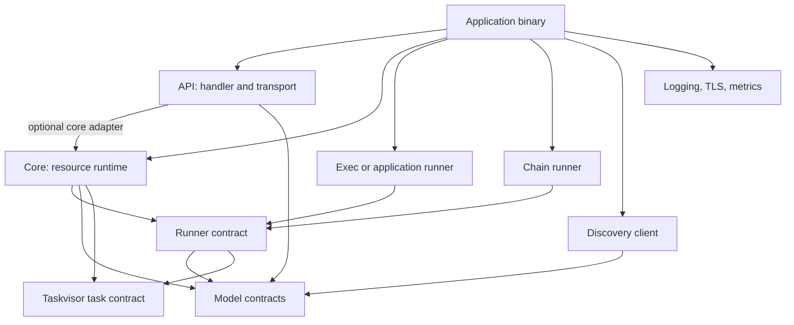

# Architecture and ownership

The SDK is an acyclic workspace of eleven product crates.
The application is the composition root: it selects features, registers
implementations, supplies configuration, starts services, and joins shutdown.
The `solti` facade forwards features and namespaces. It owns no runtime logic.

## Locate a responsibility

| Crate | Owns | Why it exists separately | Process guides |
|---|---|---|---|
| [`solti`](../crates/solti/src/lib.rs) | Feature forwarding and canonical namespaces | A binary can compose components through one dependency without changing their boundaries. | [Installation](installation.md), [agent assembly](building-an-agent.md) |
| [`solti-model`](../crates/solti-model/src/lib.rs) | Task resources, workloads, policies, queries, identities, capabilities, tokens | Callers, runtime, runners, and transports share validated data contracts. | [Resources](task-resources.md), [collections](collections-and-watches.md) |
| [`solti-runner`](../crates/solti-runner/src/lib.rs) | Runner trait, routing, build context, build admission, output and metrics interfaces | Core can construct work without depending on an execution backend. | [Custom runners](routing-and-custom-runners.md), [reconciliation](reconciliation.md) |
| [`solti-core`](../crates/solti-core/src/lib.rs) | Desired state, reconciliation, status projection, retained runs, watches, output, persistence dispatch | Resource lifecycle stays separate from operating-system execution and network serving. | [Management](managing-tasks.md), [reconciliation](reconciliation.md), [persistence](persistence.md) |
| [`solti-exec`](../crates/solti-exec/src/lib.rs) | Subprocess, container-engine, native containerd, and host-process implementations | A binary chooses execution and platform policy without coupling them to core. | [Subprocesses](subprocesses.md), [containers and isolation](containers-and-isolation.md) |
| [`solti-chain`](../crates/solti-chain/src/lib.rs) | Conditional sequential composition inside one outer Task | Existing workload runners can be combined without adding child Task resources or a new transport API. | [Chains](chains.md) |
| [`solti-api`](../crates/solti-api/src/lib.rs) | Handler contract, HTTP/gRPC boundaries, authentication and authorization hooks, optional core adapter | Transports can serve core or an application-owned handler. | [Task API](serving-api.md), [authentication](tls-and-authentication.md) |
| [`solti-discover`](../crates/solti-discover/src/lib.rs) | Outbound registration and supervised heartbeat construction | Advertising an agent is independent of how its inbound API is served. | [Discovery](discovery.md) |
| [`solti-tls`](../crates/solti-tls/src/lib.rs) | PEM material, identities, trust roots, loaded TLS/mTLS configurations | Inbound and outbound integrations share TLS types without depending on core. | [TLS and authentication](tls-and-authentication.md) |
| [`solti-observe`](../crates/solti-observe/src/lib.rs) | Global logging configuration and optional timezone-maintenance task | A binary chooses logging and supervises maintenance explicitly. | [Observability](observability.md) |
| [`solti-prometheus`](../crates/solti-prometheus/src/lib.rs) | Feature-selected producer adapters, collectors, registry helpers, exporter task | Metrics producers keep their own contracts; a binary chooses what to connect and expose. | [Observability](observability.md) |

[Taskvisor](https://github.com/soltiHQ/taskvisor) is an external dependency, not
another SDK workspace crate. It owns supervised attempt execution and keyed
admission. [`solti-benches`](../benches/README.md) is unpublished development
tooling, not a product layer.

## Distinguish dependency direction from runtime flow

Core and execution both consume the runner contract; core does not depend on exec.
API depends on core only when its `core-adapter` feature is selected.
Discovery does not depend on core and does not start an inbound server.
TLS has no SDK dependencies. Prometheus dependencies are selected by adapter features.
No component depends on the `solti` facade.

This diagram shows component consumption, not the order in which every callback runs.
The [Cargo manifests](../Cargo.toml) and [facade feature map](../crates/solti/Cargo.toml)
are the source of dependency and feature selection.

## Follow the main cross-crate processes

| Process | Handoffs | Boundary to preserve |
|---|---|---|
| Routed Task execution | Model manifest → core commit → runner selection/build → Taskvisor → backend attempt | Build is not execution; commit is not admission or success. |
| Embedded maintenance | Application or discover/observe/Prometheus creates manifest + TaskRef → core → Taskvisor | No runner selection and no public Embedded transport representation. |
| Desired-state replacement | Model spec revision → core coordinator → cancellable runner build → runtime replacement → status | Latest wins; no staged rollout or rollback of accepted external effects. |
| Conditional work | Chain extension → runner catalog → nested executable tasks → one outer Taskvisor attempt | One active step; outer policy, status, history, and output remain the resource boundary. |
| Remote management | Client → API authentication/authorization → handler/core adapter → core | Transport success keeps the underlying operation's acknowledgement boundary. |
| Live output | Backend → runner OutputSink → core channel → Rust subscriber or API stream | Bounded and lossy; exact Task identity matters. |
| State export | Core commit → ordered state dispatcher → application TaskStateSink | Callback admission is not a database transaction or restart recovery. |
| Agent advertisement | Runner capability snapshot + advertised endpoint → discovery task → control plane | Outbound heartbeat endpoint and inbound advertised endpoint are independent. |
| Metrics | Producer hooks, Taskvisor events, core snapshots → adapters/collectors → Registry → exporter | Event delivery, state reads, and scrape completion have different guarantees. |

## Keep these owners explicit

Core owns its observer, coordinator, state, retention worker, and configured
persistence dispatchers. It does not own an application's HTTP server,
external database, containerd daemon, or all backend cleanup workers merely
because a runner was registered.

Retain runner handles when they provide an explicit shutdown method.
The subprocess examples join core shutdown and then the subprocess runner's
finalizer. See [agent assembly](building-an-agent.md) and
[cancellation and shutdown](cancellation-and-shutdown.md).

## Find the implementation

- [Model source guide](../crates/solti-model/ARCHITECTURE.md): fields, ownership, validation, collections.
- [Core source guide](../crates/solti-core/ARCHITECTURE.md): resource commit, reconciliation, observer, output, shutdown.
- [Runner router](../crates/solti-runner/src/router.rs): immutable registration snapshots and build entry points.
- [Execution source guide](../crates/solti-exec/ARCHITECTURE.md): attempt ownership, platform controls, and cleanup.
- [Task API contract](../crates/solti-api/CONTRACT.md) and [discovery contract](../crates/solti-discover/CONTRACT.md): public network boundaries.
- [API reference map](api-reference.md): every product crate and its public entry points.
