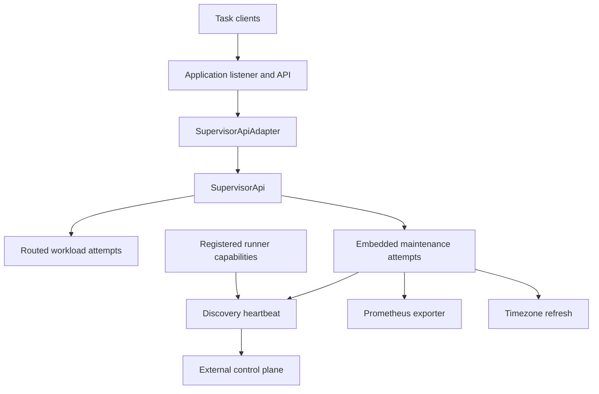

# Build an agent

An SDK agent is an application binary that owns several connected services.
There is no facade call that starts every component or shuts down every external resource.
Choose the process you need, then retain the handles that own its lifetime.

## Assign the participants

| Participant | What it contributes | What the binary still owns |
|---|---|---|
| Model | Shared manifests, capabilities, identities, policies, and tokens | Application names, workload data, credentials, and desired changes. |
| Runner and exec or a custom runner | Routing and executable TaskRef construction | Registration order, backend configuration, platform authority, and backend cleanup handles. |
| Core | Resource storage, reconciliation, observation, and supervised work | When to start it, which limits/sinks/subscribers to install, and when to join shutdown. |
| API | Router/service and a handler contract; optional core adapter | Listener, server task, TLS placement, authorization policy, intake shutdown, and active-connection drain. |
| Discovery | Outbound heartbeat manifest and TaskRef | Actual advertised address, control-plane address, identity, capabilities, revision, and submission of the task. |
| Observe and Prometheus | Logger, producer adapters, collectors, exporter/maintenance tasks | Global initialization, shared registry, injection points, endpoint access, and service supervision. |
| TLS | Loaded identity and trust configuration | Certificate distribution, listener/client installation, and rotation/reload policy. |

## Assemble the runtime

The complete [HTTP agent](../crates/solti/examples/agent_http.rs) demonstrates
this composition:

1. Bind the application-owned listener.
2. Build a `RunnerRouter` and register the subprocess runner.
3. Retain the returned subprocess runner handle.
4. Start `SupervisorApi` with the configured router.
5. Wrap it in `Arc`, then in `SupervisorApiAdapter` for the API handler boundary.
6. Build `HttpApi` and mount its router in the application server.
7. Stop intake through the server's shutdown signal, then join core and backend cleanup.

```sh
cargo run -p solti --example agent_http --locked --features api-core-adapter,api-http,exec-subprocess
```

The example binds `127.0.0.1:8085` and serves `/openapi.json` from an
application-added route. It has no authentication or TLS.
Use [Task API](serving-api.md) for the current request and UID-bound output commands,
and [TLS and authentication](tls-and-authentication.md) before exposing a service.

## Connect observations before starting work

Runner metrics belong in `BuildContext` before the router is consumed by core.
Taskvisor subscribers belong in `SupervisorApiBuilder::with_subscribers` before startup.
State/output persistence hooks also belong on that builder.
Core always installs its own observer separately.

A state collector can be attached after startup because it needs `supervisor.state()`.
The [Prometheus example](../crates/solti/examples/operations_prometheus.rs) uses
one shared registry for runner metrics, Taskvisor events, a core-state collector,
and the exporter. Creating independent registries would not combine their series.

Install process-wide logging once, before work that should emit through it.
`init_logger` does not automatically submit the timezone-maintenance task.
See [observability](observability.md) for the distinct producer and service lifetimes.

## Add maintenance as Embedded work

Discovery, timezone refresh, and the Prometheus exporter can return or construct
Embedded work. Pass the matching manifest and TaskRef to
`create_embedded_task`. Enabling their features alone does not start them.



The diagram shows composition options, not a requirement to enable all of them.
Embedded resources are visible to the application's core API but are hidden by
the public core adapter. They still consume core and Taskvisor resources.

The [discovered HTTP agent](../crates/solti/examples/agent_http_discovery.rs)
uses `supervisor.runner_capabilities()` and an independent outbound endpoint:

```sh
cargo run -p solti --example agent_http_discovery --locked --features api-core-adapter,api-http,discover-http,exec-subprocess
```

That program requires a compatible discovery HTTP server at `SOLTI_CONTROL_PLANE`
or its documented loopback default. It does not implement the control plane.
Advertising an address does not bind it or prove that remote clients can reach it.
See [discovery](discovery.md).

## Separate readiness boundaries

| Observation | What it establishes |
|---|---|
| Listener bind succeeded | The local address was acquired. |
| `SupervisorApiBuilder::start` returned | Core and its owned runtime workers started. |
| Runner capabilities were read | Registered workload/label declarations are available. |
| Maintenance manifest was committed | Desired state exists; its attempt may not have started. |
| API request completed | That request reached its handler/transport result boundary. |
| Heartbeat completed successfully | That discovery attempt received an accepted response. |

None of these alone proves every backend, dependency, remote route, or future
workload is ready. The application defines its service readiness contract.

## Own shutdown across services

The HTTP examples retain errors from serving, core shutdown, and subprocess
finalization separately. They attempt both cleanup steps before propagating the
earlier server error. That prevents an early `?` from skipping the later cleanup call.

For an application with long-lived watch/output connections, the server drain
and core stream closure also need coordination. Stopping new HTTP intake does
not close every existing stream. Waiting for those streams before requesting
the shutdown that closes them can stall an otherwise graceful server drain.
The server's connection policy and outer shutdown deadline belong to the binary.

Core shutdown cancels supervised work and drains its configured persistence
dispatchers. A backend finalizer, an external container daemon, and an
application-owned database or listener have separate owners.
Do not infer that a Task's terminal phase or dropping the last local variable
joins all those lifetimes.

See [cancellation and shutdown](cancellation-and-shutdown.md),
[subprocess cleanup](subprocesses.md), and [production boundaries](production-boundaries.md).

Source: [core builder](../crates/solti-core/src/supervisor/builder.rs),
[HTTP assembly](../crates/solti/examples/agent_http.rs),
[discovery assembly](../crates/solti/examples/agent_http_discovery.rs),
[logging assembly](../crates/solti/examples/operations_observe.rs), and
[metrics assembly](../crates/solti/examples/operations_prometheus.rs).
