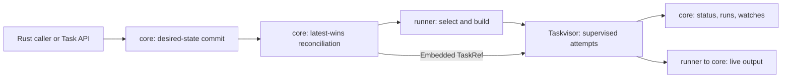

# Solti SDK overview

Solti SDK is a set of Rust components for building task-execution agents.
An agent accepts desired Task resources, reconciles them into executable work,
supervises attempts, and exposes observed state.
The application chooses which components to assemble.

These guides follow processes across crates.
Each process identifies the participating crates, the boundary they own, and
the application work that remains outside the SDK.
Use the [architecture map](architecture.md) to locate a responsibility and the
[API reference map](api-reference.md) for exact public interfaces.

## Choose a starting point

| Need | Start here | Main participants |
|---|---|---|
| Understand desired state and execute one local task | [Quick start](quick-start.md), [mental model](mental-model.md) | `solti-model`, `solti-core`, Taskvisor |
| Assemble a service that owns execution and shutdown | [Build an agent](building-an-agent.md) | Application, runner, core, optional API and operations |
| Run a command or script | [Subprocesses](subprocesses.md) | Model, runner, exec, core |
| Supply a custom workload or execution backend | [Routing and custom runners](routing-and-custom-runners.md) | Model, runner, application |
| Run a native container or configure host controls | [Containers and isolation](containers-and-isolation.md) | Model, exec, external runtime or host |
| Compose conditional sequential work | [Chains](chains.md) | Chain, runner catalog, execution backends, core |
| Expose an agent to clients | [Task API](serving-api.md), [TLS and authentication](tls-and-authentication.md) | API, handler or core adapter, application server |
| Advertise an agent to a control plane | [Discovery](discovery.md) | Discover, model, supervised Embedded work |
| Observe, retain, or export operational data | [Observability](observability.md), [persistence hooks](persistence.md) | Core, runner, observe, Prometheus, application sinks |

## Check the fit

Use the SDK when work needs resource identity, desired-state updates, runner
selection, observed status, or a public agent boundary.
For ordinary in-process async supervision without those resource contracts,
[Taskvisor](https://github.com/soltiHQ/taskvisor) can be used directly.

The SDK does not supply a control-plane server, durable job queue, database,
tenant model, or deployment topology.
The application owns those concerns when it needs them.
Read [production boundaries](production-boundaries.md) before deployment.

## Follow one Task

An accepted write is not proof that the runner built, the slot admitted work,
or an attempt succeeded.
State, run history, watch journals, and output have different retention and
delivery contracts. They are not a durable execution log.

## Read the guides in context

- [Installation](installation.md) maps application needs to features; enabling a feature does not register or start its service.
- [Task resources](task-resources.md) separates caller-owned fields from server-owned identity and status.
- [Reconciliation](reconciliation.md) explains latest-wins updates and failed builds.
- [Cancellation and shutdown](cancellation-and-shutdown.md) separates logical completion from physical cleanup.
- [Configuration](configuration.md) identifies independent resource budgets and deadlines.
- [Example catalog](example-catalog.md) links the complete programs and smaller component examples.
- [Process benchmarks](../benches/README.md) describe measured boundaries, not deployment capacity guarantees.

## All guide pages

- **Start:** [Overview](index.md), [Quick start](quick-start.md), [Mental model](mental-model.md), [Installation and features](installation.md), [Architecture and ownership](architecture.md).
- **Build an agent:** [Application assembly](building-an-agent.md), [Routing and custom runners](routing-and-custom-runners.md), [Subprocesses](subprocesses.md), [Containers and isolation](containers-and-isolation.md), [Chains](chains.md).
- **Manage work:** [Task resources](task-resources.md), [Task management](managing-tasks.md), [Reconciliation](reconciliation.md), [Lifecycle and admission](lifecycle-and-admission.md), [Collections and watches](collections-and-watches.md), [Output and run history](output-and-history.md), [Cancellation and shutdown](cancellation-and-shutdown.md).
- **Expose and connect:** [Task API](serving-api.md), [Discovery](discovery.md), [TLS and authentication](tls-and-authentication.md).
- **Operate:** [Configuration](configuration.md), [Observability](observability.md), [Persistence hooks](persistence.md), [Production boundaries](production-boundaries.md), [Common mistakes](common-mistakes.md).
- **Reference:** [Example catalog](example-catalog.md), [API reference map](api-reference.md).

The same pages are listed in [site.yml](site.yml) for generated-site navigation.
The links above also work when reading the repository directly.
