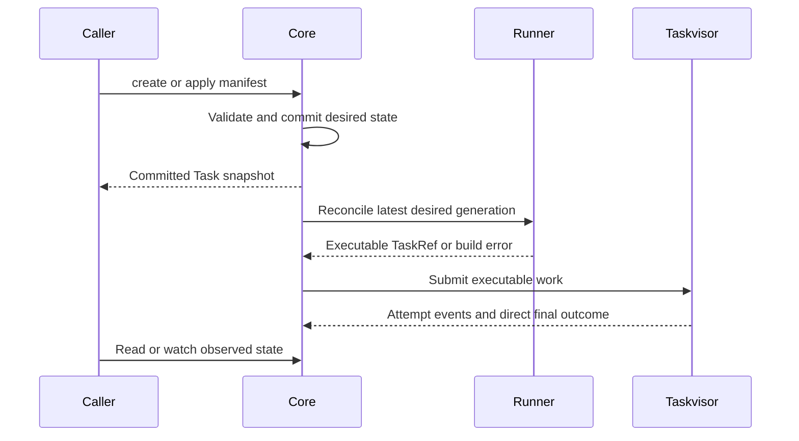

# Mental model

A Solti Task is a desired resource, not a running future or operating-system process.
Core reconciles that resource into executable work.
Taskvisor can run more than one attempt of that work under the selected policy.

## Separate the objects

| Object | Owner and purpose |
|---|---|
| `TaskManifest` | Caller-owned name, labels, annotations, and desired spec. It is the write input. |
| `Task` | Core-owned resource combining desired fields, server metadata, and observed status. |
| `TaskWorkload` | Model envelope naming the work's GVK and payload. It is not an installed runner. |
| `Runner` | Converts a routed Task into reusable executable work through `build_task`. |
| `BuiltTask` | Runner build result containing a `RunId` and Taskvisor `TaskRef`. |
| `TaskRef` | In-process implementation that creates a fresh future for each attempt. |
| `TaskRun` | Retained projection of one generation/attempt, subject to event visibility and retention. |
| `TaskWatchEvent` | Change to a resource in core's bounded collection journal. |
| `OutputEvent` | Live attempt output or loss notification, not replayable Task history. |

`solti-model` defines the resource contracts; `solti-runner` defines construction;
`solti-core` connects them to Taskvisor.
The [architecture map](architecture.md) identifies the optional execution,
transport, discovery, and operations components.

## Name each identity

| Identity | Scope | What it does not mean |
|---|---|---|
| `metadata.name` / model `TaskId` | Address of a resource within one core state | A name can later identify a different resource after deletion/recreation. |
| `metadata.uid` | One resource incarnation | It is not a slot or attempt number. |
| `metadata.generation` | Desired spec revision within that incarnation | Metadata-only edits do not advance it. |
| `metadata.resourceVersion` | Opaque Task-state revision for reads, guards, and watches | It is not a generation, timestamp, or TaskRun continuation. |
| `status.observedGeneration` | Desired generation whose reconciliation status is being reported | A matching value does not by itself mean that an attempt succeeded. |
| `status.attempt` | Observed attempt number in the current generation | Attempt zero can mean execution has not started. |
| `spec.slot` | Taskvisor controller coordination key within one supervisor | It is not Task identity, a tenant boundary, or a distributed lock. |
| runner `RunId` | One executable build's runtime identity | One build can serve several attempts; it is not a `TaskRun`. |

Taskvisor also has its own task/submission ID type.
Do not confuse it with `solti_model::TaskId`, which is the SDK resource name.
See [resource identity](task-resources.md) and [run history](output-and-history.md).

## Separate acknowledgements

The diagram shows the routed-workload path. Embedded submission supplies a
prebuilt TaskRef and bypasses runner selection and build. It separates
contracts; it does not promise that the caller prints its acknowledgement
before asynchronous work starts.

- A write commits desired state. A later build or admission can fail.
- `Reconciled=True` records runtime intake for the observed generation. It is not a success result for the workload.
- A terminal attempt phase can be followed by another attempt under retry or periodic policy.
- A terminal SDK phase, cancellation acknowledgement, and physical slot release are different boundaries.

Choose the expected generation and lifecycle policy before deciding what a
successful observation means. The [quick start](quick-start.md) uses `Never`
and a single Task incarnation to keep that boundary explicit.

## Treat replacement as reconciliation

Applying a changed spec advances the desired generation and schedules work.
Core can coalesce intermediate generations when newer desired state arrives.
It protects the current UID and generation from stale completions.
It does not undo side effects that older accepted work already performed.

An identical apply is normally a no-op; an identical apply after failed
reconciliation can request a retry without creating a new desired generation.
Metadata-only changes and caller-supplied Embedded implementations have their
own rules. Read [task management](managing-tasks.md) and
[reconciliation](reconciliation.md) before building update logic.

## Choose the observation path

| Question | SDK path |
|---|---|
| What is the current resource? | `get_task` or a Task collection query. |
| What changed since a retained revision? | Task watch, with expiry handling. |
| What attempts are retained? | TaskRun query and its independent snapshot continuation. |
| What is the runner emitting now? | Live output subscription for the correct identity. |
| What should an external store receive? | State/output persistence hooks and their separate delivery status. |
| What operational activity occurred? | Logs, metrics, and Taskvisor subscribers. |

Core uses direct Taskvisor outcomes internally to settle final state independently
of terminal event loss. It does not expose a Taskvisor waiter from `create_task`.
Detailed attempt history and operational event metrics can still be incomplete.
See [collections](collections-and-watches.md), [output and history](output-and-history.md),
and [observability](observability.md).
